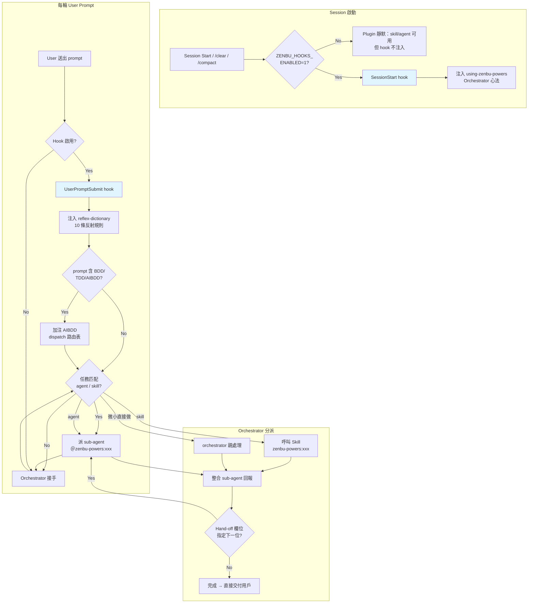
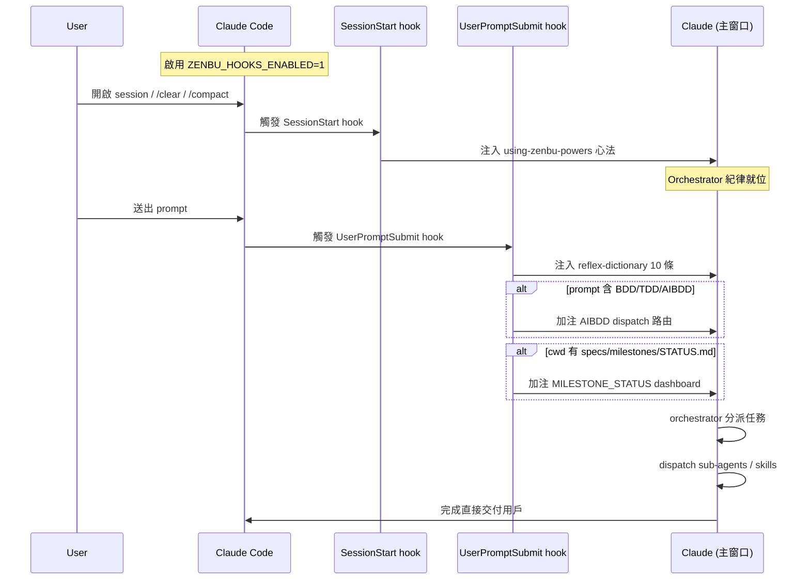

# zenbu-powers — Claude Code Plugin

> 為 **zenbu org** 量身打造的 Claude Code Plugin。內建 Orchestrator 心法注入、21 個全域 Agent、59 個全域 Skill，外加 `agent-sets/` / `skill-sets/` 條件載入資源（含 WordPress 全棧），覆蓋 WordPress、React / NestJS / Node.js 現代應用、AIBDD 行為驅動開發三大領域，讓 AI 工程師團隊從第一個 session 就知道如何分工。

**兩層 Hook 架構**：SessionStart 注心法、UserPromptSubmit 注 reflex（10 條交接規則）+ AIBDD 條件式 + Milestone Status 條件式注入。主窗口完成後直接交付用戶。AIBDD 三語言整合測試（TypeScript / PHP / C#）完整覆蓋。內建 **Milestone Tracker** 專案級任務追蹤管理，AI 開工前自動知道當前進度與下一步。

---

## 設計哲學

```
你（使用者）
    │
    ▼
Orchestrator（Claude 主窗口）
    │  分析需求、拆解子任務、整合報告
    ├──► Agent Team（平行或序列委派）
    │        ├── react-master          ← React / TSX 實作
    │        ├── nestjs-master         ← NestJS / TypeScript 實作
    │        ├── *-reviewer / security-reviewer ← 深度審查（opt-in：用戶喚醒）
    │        ├── ...（全域共 21 個）
    │        └── wordpress-master / wordpress-reviewer ← 經 /copy-sets 條件載入
    │
    └──► Skills（流程 / 知識 / Library 參考）
             ├── /brainstorming     ← 設計精進
             ├── /tdd-workflow      ← Red→Green→Refactor
             ├── /aibdd-*           ← AIBDD 全自動 BDD 套件
             └── ...（全域共 59 個，另有 skill-sets 條件載入）
```

**兩層 Hook 架構**讓「協調紀律」在第一輪 prompt 之前就到位：

1. **SessionStart hook** — session 啟動 / `/clear` / `/compact` 時注入 `using-zenbu-powers` 的完整 Orchestrator 心法（Agent 索引、Skill 快取、Red Flags、全域一致性守則）
2. **UserPromptSubmit hook** — 每次送 prompt 注入 reflex-dictionary 10 條反射規則；命中 `BDD/TDD/AIBDD` 觸發詞時加注 AIBDD dispatch 路由；cwd 內 `specs/milestones/STATUS.md` 存在時加注 Milestone Status dashboard

整套機制由 `ZENBU_HOOKS_ENABLED=1` 環境變數**顯式啟用**（opt-in，避免干擾未準備好的 user）。

---

## 整體運作流程



---

## 安裝方式

### 從 Marketplace 安裝

```bash
claude plugin marketplace add zenbuapps/zenbu-powers
claude plugin install zenbu-powers
```

### 從本地目錄安裝

```bash
claude plugin install ./zenbu-powers
```

### 更新 / 移除

```bash
claude plugin update zenbu-powers@zenbu-powers
claude plugin uninstall zenbu-powers
```

### 驗證安裝

```bash
claude plugin list   # 列出已安裝的 Plugin
/skills list         # 列出可用的 Skill
/agent               # 列出可用的 Agent
```

### 啟用 Hook（必要）

zenbu-powers 的核心紀律仰賴 hook 注入，**預設不啟用**。在 `~/.claude/settings.json` 加：

```json
{
  "env": {
    "ZENBU_HOOKS_ENABLED": "1"
  }
}
```

設定後重啟 session 即可。未啟用時，agents / skills 仍可手動呼叫，但 SessionStart / UserPromptSubmit hook 不會注入心法與 reflex。

---

## Agents（21 個全域 + WordPress agent-set）

> **WordPress agent**（`wordpress-master`、`wordpress-reviewer`）不在 plugin 全域常駐，已移至 `agent-sets/wordpress/`。偵測到 WordPress 專案時由 `/copy-sets` 條件複製進專案 `.claude/agents/`，複製後以**無前綴**名稱（`@wordpress-master`）調用。

### React / Frontend

| Agent | 說明 |
|---|---|
| `react-master` | React 18 / TypeScript，Refine、Ant Design、TanStack Query |
| `react-reviewer` | React 程式碼審查（**opt-in**：用戶顯式喚醒才上場；不在自動流程中） |

### NestJS / Node.js

| Agent | 說明 |
|---|---|
| `nestjs-master` | NestJS 10+ / TypeScript，模組化架構、DI、Guards、TypeORM/Prisma |
| `nestjs-reviewer` | NestJS 程式碼審查（**opt-in**：用戶顯式喚醒才上場；不在自動流程中） |
| `nodejs-master` | Node.js 20+ / TypeScript，RESTful API、BullMQ、Zod、Prisma |

### 架構 / 設計

| Agent | 說明 |
|---|---|
| `planner` | 複雜功能與重構的實作計畫設計師 |
| `clarifier` | 結構化需求訪談，輸出使用者故事與驗收標準 |
| `ddd-architect` | DDD 重構規劃，識別 Code Smell、排序重構步驟 |
| `tdd-coordinator` | 接收 planner 計畫，強制執行 Red→Green→Refactor 迴圈 |

### 測試 / 品質 / 驗收

| Agent | 說明 |
|---|---|
| `browser-tester` | git diff 驅動的瀏覽器模擬測試，錄製影片與截圖 |
| `test-creator` | 通用測試工程師，E2E + 整合測試完整覆蓋 |
| `security-reviewer` | OWASP Top 10、WordPress XSS/SQL Injection/CSRF、依賴漏洞（**opt-in**：用戶顯式喚醒才上場；不在自動流程中。涉及 auth / payment / external-api 時強烈建議補派） |

### DevOps / CI

| Agent | 說明 |
|---|---|
| `workflow-master` | GitHub Actions 製作、除錯、優化，支援 act 本地驗證 |
| `conflict-resolver` | 分析衝突分支意圖，規劃最佳解法後推回各分支 |

### 文件 / 知識管理

| Agent | 說明 |
|---|---|
| `doc-manager` | 協調子代理全面管理 CLAUDE.md、rules、specs 文件體系 |
| `doc-updater` | 功能實作後自動同步 CLAUDE.md 與 rules |
| `lib-skill-creator` | 爬取官方文件，萃取為 API reference 級別的 SKILL |
| `markdown-creator` | 將 PDF/Word/HTML/圖片轉換為高品質 Markdown |
| `claude-manager` | Claude Code 設定最佳實踐審查（CLAUDE.md、settings、hooks、9 大 audit-scope 對齊） |
| `prompt-optimizer` | Prompt 診斷優化與跨用途轉換 |

---

## Skills（59 個全域 + skill-sets 條件載入）

> 下列 Orchestrator / AIBDD / Agent Playbook / 工作流程類 skill 為 plugin **全域常駐**（`skills/`，共 59 個）。
> WordPress / React 框架 / 後端 Library 類 skill 屬 **`skill-sets/` 條件載入資源**——偵測到對應技術棧時由 `/copy-sets` 複製進專案 `.claude/skills/`，複製後以**無前綴**名稱調用。

### Orchestrator 流程與驗收（必讀）

| Skill | 說明 |
|---|---|
| `/using-zenbu-powers` | Orchestrator 心法、Agent/Skill 索引、Red Flags（SessionStart 自動注入） |
| `/brainstorming` | Socratic 對話精煉需求 + HARD-GATE（未獲批准禁止實作） |
| `/dispatching-parallel-agents` | 何時並行派 agent、何時必須序列化的判斷規範 |
| `/clarify-loop` | 需求釐清迴圈 |
| `/plan` | 任務分解與實作規劃 |
| `/systematic-debugging` | 4 階段根因調查，含 WP / React / AIBDD 常見 bug 對照表 |
| `/tdd-workflow` | Red → Green → Refactor 執行 playbook，含 Evidence 鐵律 |
| `/finishing-branch` | Merge / PR / Keep / Discard 決策樹 + worktree 清理 |
| `/acceptance-evaluation` | 驗收標準對齊評估方法論（零假設驗收前置鐵律、多階段任務驗收規範） |
| `/milestone-tracker` | **專案級任務追蹤管理**：資料夾狀態機（todo/doing/done）+ ROADMAP/STATUS dashboard。AI 開工前自動讀 STATUS、新需求自動歸檔、完成自動更新；UserPromptSubmit hook 注入當前進度給 AI；與 `aibdd-carry-on-engineering-plan` 互補（前者管 business / Week-by-Week，後者管 feature-level 7-phase plan） |

### AIBDD — AI 行為驅動開發（全自動 BDD 套件，17 個 skill）

AIBDD 是 zenbu-powers 的核心差異化能力。從 BDD 分析到整合測試，全程由 skill 驅動，支援 **TypeScript / PHP / C#** 三種語言。

#### 分析與設計（11 個）

| Skill | 說明 |
|---|---|
| `/aibdd-kickoff` | AIBDD 開發啟動儀式 |
| `/aibdd-discovery` | 行為發現與 Domain 探索（Phase 01：composition → flow → behavior） |
| `/aibdd-core` | AIBDD 核心概念與架構（reconciler contract reference） |
| `/aibdd-specformula` | Spec 撰寫公式（需求層級全流程工程計畫產生器） |
| `/aibdd-form-feature-spec` | Feature Spec 表單（Gherkin Feature File） |
| `/aibdd-form-entity-spec` | Entity Spec 表單（DBML 資料模型） |
| `/aibdd-form-api-spec` | API Spec 表單（OpenAPI） |
| `/aibdd-form-bdd-analysis` | BDD 分析表單（句型模型、覆蓋矩陣） |
| `/aibdd-form-activity` | Activity 設計表單（Mermaid 流程圖） |
| `/aibdd-composition-analysis` | 組成分析（KICKOFF / CHANGE 雙模式） |
| `/aibdd-consistency-analyzer` | 一致性驗證 |

#### 通用自動化（6 個，語言無關）

| Skill | 說明 |
|---|---|
| `/aibdd-auto-tdd` | TDD 自動化統一入口（紅燈 / 綠燈 / 重構 / control-flow / starter）—— 8 stage × 3 語言（C# / PHP / TS）雙軸路由樞紐 |
| `/aibdd-handlers` | 6 類 Handler（Command / Query / Aggregate-Given / Aggregate-Then / ReadModel-Then / Success-Failure）統一參考 |
| `/aibdd-carry-on-engineering-plan` | 續接工程計畫 |
| `/aibdd-auto-frontend-nextjs-pages` | Next.js 頁面自動化 |
| `/aibdd-auto-frontend-msw-api-layer` | MSW API 層自動化 |
| `/aibdd-auto-frontend-apifirst-msw-starter` | API First MSW 起手式 |

### WordPress（19 個 skill-set，條件複製）

> 全部位於 `skill-sets/`，非全域常駐。`/copy-sets` 偵測到 WordPress 專案時複製進 `.claude/skills/`，複製後以無前綴名稱調用。其中 `wordpress-standards`、`wordpress-router`、`wp-phpstan`、`wp-project-triage`、`wp-testing` 為近期從 `skills/` 全域常駐搬遷而來。

| Skill | 說明 |
|---|---|
| `/wp-plugin-development` | 外掛架構、Hooks、Settings API、安全性、打包發佈 |
| `/wp-block-development` | 靜態/動態區塊、block.json、Inner Blocks |
| `/wp-block-themes` | FSE Block Theme、theme.json、Templates、Patterns |
| `/wp-interactivity-api` | Directives、Server-Side Rendering |
| `/wp-rest-api` | 自訂端點、身份驗證、Custom Post Types |
| `/wp-performance` | 資料庫查詢、物件快取、Autoload 優化 |
| `/wp-abilities-api` | 角色與權限管理 |
| `/wp-wpcli-and-ops` | 自動化部署、Multisite、資料庫操作 |
| `/wp-phpstan` | 靜態分析設定、WordPress 型別標註 |
| `/wp-playground` | 沙盒環境、Blueprint 設定 |
| `/wp-testing` | WordPress Plugin 測試統一入口（E2E + Integration；含決策樹） |
| `/wp-project-triage` | WP 專案健康檢查 |
| `/wp-mcp-adapter` | WP MCP 適配器 |
| `/wordpress-router` | 前端路由決策樹 |
| `/wordpress-standards` | WordPress 規範統一入口（coding / review checklist / security checklist 三視角） |
| `/woocommerce-hpos` | WooCommerce HPOS 高效能訂單存儲 |
| `/wpds` | WordPress 元件設計系統 |
| `/vite-for-wp-v0-12` | Vite for WordPress |
| `/powerhouse-v3-3` | Powerhouse v3.3 |

### React / 前端框架（22 個）

| Skill | 說明 |
|---|---|
| `/react-coding-standards` | React / TypeScript 最佳實踐 |
| `/react-review-criteria` | React 審查標準 |
| `/react-master` | React 開發主技能 |
| `/react-router` | React Router（依 package.json 自動切 v6 / v7） |
| `/refine` | Ant Design + Refine 框架開發（依 package.json 自動切 v4 / v5） |
| `/antd-v5` | Ant Design v5 元件庫 API 參考 |
| `/antd-toolkit` | antd-toolkit (j7-dev/antd-toolkit) WP / Refine 整合元件 |
| `/ant-design-pro-v2` | Ant Design Pro Components（ProTable / ProForm 等） |
| `/react-flow-v12` | React Flow 流程圖 |
| `/tanstack-query` | TanStack Query 資料請求（依 package.json 自動切 v4 / v5） |
| `/jotai-v2` | Jotai 原子化狀態管理 |
| `/frontend-design` | 前端設計原則 |
| `/zenbu-design-system` | Zenbu 設計系統 |
| `/blocknote-v0-30` | BlockNote 富文本編輯器 |
| `/i18next-v25` | i18next 國際化 |
| `/vidstack-hls-v1` | Vidstack HLS 影片播放 |
| `/tailwindcss` | Tailwind CSS（依 package.json 自動切 v3 / v4） |
| `/pdf-lib-v1-17` | PDF 操作 |
| `/next-intl-v4` | next-intl 國際化 |
| `/nextjs` | Next.js（依 package.json 自動切 v15 / v16） |
| `/react-hook-form-v7` | React Hook Form v7 |
| `/tiptap-v2` | Tiptap 富文本編輯器 |

### NestJS / Node.js / 後端（11 個）

| Skill | 說明 |
|---|---|
| `/nestjs-v11` | NestJS 11 開發參考 |
| `/nestjs-coding-standards` | NestJS 編碼標準 |
| `/nestjs-review-criteria` | NestJS 審查標準 |
| `/nodejs-master` | Node.js 開發主技能 |
| `/typeorm-v0-3` | TypeORM v0.3 |
| `/drizzle-orm-v0-38` | Drizzle ORM v0.38 |
| `/bullmq-v5` | BullMQ v5 任務佇列 |
| `/zod-v3` | Zod v3 資料驗證 |
| `/better-auth-v1-4` | Better Auth v1.4 |
| `/stripe-node-v22` | Stripe Node.js SDK v22 |
| `/docker-compose` | Docker Compose |

### DevOps / CI / 工具（7 個）

| Skill | 說明 |
|---|---|
| `/github-actions` | GitHub Actions 工作流程 |
| `/workflow-master` | CI/CD pipeline 製作與除錯 |
| `/claude-code-action` | Claude Code GitHub Action |
| `/cloudflare-pages-wrangler` | Cloudflare Pages 部署 |
| `/octokit-rest-v21` | Octokit REST API |
| `/issue-creator` | GitHub Issue 自動建立 |
| `/aho-corasick-skill` | 批次字串掃描（全域一致性必用） |

### Agent Playbook / 品質（9 個）

> 這些 skill 是 agent 的「工作手冊」，由對應 agent 載入運作，也可獨立呼叫。
> `wordpress-master` 的 playbook skill 已隨 agent 移至 `skill-sets/wordpress-master/`（見上方 WordPress 區塊，條件複製）。

| Skill | 說明 |
|---|---|
| `/react-master` | react-master agent playbook |
| `/nodejs-master` | nodejs-master agent playbook |
| `/browser-tester` | browser-tester agent playbook |
| `/conflict-resolver` | conflict-resolver agent playbook |
| `/lib-skill-creator` | lib-skill-creator agent playbook |
| `/markdown-creator` | markdown-creator agent playbook |
| `/claude-manager` | claude-manager agent playbook（9 大 audit-scope） |
| `/ddd-refactoring` | DDD 重構 playbook |
| `/test-creation-playbook` | 測試建立 playbook |

### 工作流程（8 個）

| Skill | 說明 |
|---|---|
| `/git-commit` | 產生符合慣例的 Commit Message |
| `/finishing-branch` | 分支收尾決策樹 |
| `/conflict-resolver` | 衝突解決流程 |
| `/prompt-optimization` | Prompt 優化 |
| `/notebooklm` | NotebookLM 知識庫整合 |
| `/nuwa` | Agent 工廠（依黃金法則創建薄殼 Agent + Skills） |
| `/doc-sync-playbook` | 文件同步 playbook |
| `/doc-scaffolding-workflow` | 文件鷹架建立流程 |

---

## Slash Commands（4 個）

zenbu-powers 目前註冊 4 個 slash command：

| Command | 用途 |
|---|---|
| `/copy-sets` | 偵測專案技術棧，將配對的 `skill-set` / `agent-set` 複製到專案 `.claude/`（如 WordPress 專案複製 wordpress agent-set 與 wp-* skill-sets） |
| `/ide-on` | 啟用 IDE MCP（讀 VS Code selection / diagnostics） |
| `/ide-off` | 停用 IDE MCP |
| `/ide-status` | 查 IDE MCP 啟用狀態 |

---

## Hook 兩層架構詳解

### Hook 啟用順序



### 1. SessionStart Hook — 注入 Orchestrator 心法

**觸發**：session 啟動、`/clear`、`/compact` 時各執行一次。

**動作**：執行 `hooks/run-hook.cmd session-start` → 注入 `using-zenbu-powers` SKILL 全文（Agent 索引、Skill 索引、Red Flags、全域一致性守則等）。

**跨平台輸出**：透過 polyglot wrapper 自動偵測 IDE，輸出對應 JSON 格式：
- **Claude Code** — 標準 `hookSpecificOutput.additionalContext`
- **Cursor** — `additional_context` 欄位
- **Copilot CLI** — SDK 標準 `additionalContext` 欄位
- **Windows** — `cmd.exe` 解析，自動偵測 Git Bash
- **macOS / Linux** — bash 直接執行

若環境無 bash，hook silent exit 0，plugin 其餘功能不受影響。

### 2. UserPromptSubmit Hook — 每輪反射 + AIBDD 條件式

**觸發**：每次 user 送 prompt 時。

**動作**：合併輸出三段 context（同一個 `additionalContext` 字串）：

1. **Reflex Dictionary（無條件）** — `hooks/reflex-dictionary.txt` 的 10 條協調紀律：
   - ① 命名規範 ② orchestrator 角色 ③ 自主決策 ④ 鏈式委派 ⑤ 第一性原理 default-on ⑥ 不中途停下 ⑦ WHAT vs HOW ⑧ Skill 優先順序 ⑨ 瀏覽器自助 ⑩ Milestone 自查
2. **AIBDD 模式（條件式）** — `hooks/aibdd-mode-prompt.txt` 的 dispatch 路由表，僅當 prompt 含 `AIBDD` / `BDD` / `TDD` 觸發詞時注入
3. **Milestone Status（條件式）** — cwd 內 `specs/milestones/STATUS.md` 存在時，注入 `<MILESTONE_STATUS>` 區塊（STATUS.md head -40 + 活躍 milestone 列表）。讓 AI 每輪自動知道「現在做到哪 / 下一步 48h」

**AIBDD 觸發判斷**：
- **關鍵字**：`AIBDD` / `BDD` / `TDD`
- **比對規則**：word boundary（`\b...\b`）＋ case-insensitive
- **覆寫詞先命中時整段跳過**：`直接 / 自己來 / 跳過 skill / 不要 BDD / 先 patch / skip BDD` 等

**AIBDD 三條 dispatch 路由**：

| 情境 | 派發目標 |
|---|---|
| 全流程（預設） | `@zenbu-powers:clarifier` → 規格化 + 紅綠重構鏈 |
| 僅 Phase 01 拆解 | `zenbu-powers:aibdd-discovery` skill |
| 僅 TDD 紅綠重構 | `@zenbu-powers:tdd-coordinator` |

**Milestone Status 觸發判斷**：
- **條件**：cwd 內 `specs/milestones/STATUS.md` 存在（用 hook stdin `.cwd` 或 `$PWD` 偵測）
- **關閉開關**：環境變數 `ZENBU_MILESTONE_TRACKER_DISABLED=1` 可單獨關閉本段；reflex / AIBDD 仍會注入
- **token 預算**：head -40 + active doing/ ≤ 500 tokens
- **無污染**：non-milestone 專案自動跳過注入

---

## 核心紀律

zenbu-powers 在 v3.6 之後逐步引入下列紀律，由 SessionStart hook 與 reflex-dictionary 強制注入，所有 agent / orchestrator 均受其約束：

### 鏈式委派（Chained Delegation）

Sub-agent 回報後，主窗口讀取「Hand-off / Next Agent」標示自動 dispatch 下一位，不停下問用戶。`*-reviewer` agents **不在**自動鏈中（opt-in：用戶顯式喚醒才上場）。預設純 sub-agent 鏈式委派，不開 Teams / Worktree。

### 自主決策授權（v3.7）

遇到多個合理方案時，Orchestrator **必須自選一個並推進**，不得把選擇題丟回給用戶。決策 heuristic：與既有架構一致 → 可逆性高 → 最小驚訝 → 保守優先 → 資訊充足者勝。三類窄門例外（不可逆操作確認 / 用戶獨有資訊 / 3 輪 FAIL 升級）才暫停回報。

### Reviewer Agent Loop（Opt-in）

`*-reviewer` agents 預設**不在**自動開發流程中——`*-master` 完成後直接交給主窗口；用戶可在主窗口交付後顯式喚醒 reviewer 做深度審查。

若用戶顯式啟動「reviewer ↔ master」修復迴圈，適用「**最多 3 輪**」上限，第 3 輪未過則升級用戶裁決。涉及 auth / payment / external-api 等敏感領域，建議補派 `@security-reviewer`。

### Milestone 追蹤管理（v3.16）

cwd 內 `specs/milestones/` 存在時，AI 適用 **reflex 第 10 條 Milestone 自查**：

- **開工前**：自動讀 `<MILESTONE_STATUS>` 注入區塊（hook 已注入）或呼叫 `zenbu-powers:milestone-tracker` skill 的 `next` action 找下一個任務，**禁問 user「該做什麼」**
- **新需求進來**：自動 `milestone-tracker create` 寫進 `todo/`，**禁口頭收下不歸檔**
- **完成任務**：自動 `milestone-tracker complete` 或 `update-status`，**禁等 user 提醒才更新**

**設計原則**（與 `aibdd-carry-on-engineering-plan` 互補）：

| 層級 | Skill | 管什麼 |
|------|-------|--------|
| business / project | `milestone-tracker` | Week 1-12、KPI、商業目標、跨多 feature 的進度 dashboard |
| feature engineering | `aibdd-carry-on-engineering-plan` | 7-phase AIBDD 規格化 + 紅綠重構 |

一個 milestone 卡片可掛 ≥ 1 個 carry-on `plan_dir`；planner 完成 plan 後自動 `link-plan` 串接。

**資料夾狀態機**（單一真相）：

```
{repo}/specs/milestones/
├── ROADMAP.md           # 大計畫一頁總覽（業務目標 + Week 1-12 + KPI）
├── STATUS.md            # 每週 dashboard（hook head -40 注入給 AI）
├── milestones.yml       # machine-readable index
├── todo/                # M0X-{slug}.md 待開
├── doing/               # 進行中（hook 列表注入）
└── done/                # 已完成
```

狀態由卡片所在資料夾決定，不靠 frontmatter `status:` 欄位（folder 是真相，frontmatter 是顯示用）。

**關閉開關**：環境變數 `ZENBU_MILESTONE_TRACKER_DISABLED=1` 可關閉 hook 注入；reflex 第 10 條的行為紀律仍會注入（AI 看到 cwd 有 milestones/ 仍會自查）。完整規範見 `skills/milestone-tracker/SKILL.md`。

---

## MCP Servers

| MCP Server | 說明 |
|---|---|
| Serena | 程式碼語意搜尋，快速定位引用關係與符號 |

> 💡 **為什麼沒有 Playwright MCP？** zenbu-powers 的瀏覽器自動化統一改用 **`playwright-cli` SKILL**（直接呼叫 CLI），不走 MCP server。這樣做的好處：啟動快、無需常駐 process、跨平台穩定、debug 時可直接在終端重現指令。`browser-tester`、`test-creator`、`markdown-creator` 等 agent 皆已改用此模式。

---

## 專案結構

```
zenbu-powers/
├── .claude-plugin/
│   ├── plugin.json            # Claude Code Plugin 主設定
│   └── marketplace.json       # Marketplace 上架設定
├── hooks/                     # 兩層 Hook 架構
│   ├── hooks.json             # SessionStart / UserPromptSubmit 兩 hook 宣告
│   ├── run-hook.cmd           # 跨平台 polyglot wrapper
│   ├── session-start          # SessionStart hook 實作（注入 using-zenbu-powers）
│   ├── user-prompt-submit     # UserPromptSubmit hook 實作（reflex + AIBDD 條件式）
│   ├── reflex-dictionary.txt  # 10 條每輪反射規則（含 milestone 自查）
│   └── aibdd-mode-prompt.txt  # AIBDD dispatch 路由表
├── agents/                    # 21 個全域 Agent 定義檔
│   ├── nestjs-master.agent.md
│   ├── react-master.agent.md
│   └── ...
├── agent-sets/                # 條件載入 Agent set（由 /copy-sets 複製進專案）
│   └── wordpress/             # wordpress-master + wordpress-reviewer
├── skills/                    # 59 個全域 Skill 定義檔
│   ├── using-zenbu-powers/    # Orchestrator meta-skill（SessionStart 注入）
│   ├── brainstorming/         # Socratic 設計精進 + HARD-GATE
│   ├── acceptance-evaluation/ # 零假設驗收前置鐵律
│   ├── aibdd-*/               # AIBDD 全自動 BDD 套件
│   └── ...
├── skill-sets/                # 條件載入 Skill set（由 /copy-sets 複製進專案）
│   ├── wordpress-master/ wordpress-router/ wordpress-standards/
│   ├── wp-*/                  # WordPress 全棧 skill-sets
│   └── antd-* / refine / nextjs / ...  # 框架 / Library 參考 set
├── commands/                  # 4 個 Slash Commands
│   └── copy-sets.md / ide-on.md / ide-off.md / ide-status.md
├── scripts/                   # 輔助 Node.js 腳本
│   ├── ide-toggle.mjs         # IDE MCP 切換
│   └── release.sh             # 發版腳本
├── prompts/                   # Prompt 範本
└── .mcp.json                  # MCP Server 設定（目前只有 Serena）
```

---

## 使用範例

安裝完成後（並設定 `ZENBU_HOOKS_ENABLED=1`），Claude 在 session 啟動時已自動載入 Orchestrator 心法。你只需要用**自然語言**描述需求，Claude 會判斷要委派哪個 Agent、呼叫哪個 Skill。無需記憶指令清單。

### 範例 1：開發一個全新 WordPress 外掛

```
我要做一個 WooCommerce 訂單匯出外掛，支援 HPOS，要有 REST API
```

Claude 的自動流程：

0. **`/copy-sets`** — 偵測到 WordPress 專案，複製 wordpress agent-set 與 wp-* skill-sets 進 `.claude/`（WordPress agent / skill 非全域常駐，需此步後方可無前綴調用）
1. **`/brainstorming`** — Socratic 對話精煉需求（支援哪些欄位？權限？Rate limit？）
2. **`@clarifier`** — 輸出結構化使用者故事與驗收標準
3. **`@planner`** — 產出實作計畫
4. **`@wordpress-master`** — 依計畫實作，過程中自動參考 `/wp-plugin-development`、`/wp-rest-api`、`/woocommerce-hpos`
5. **完成 → 直接交付用戶**
6. **（Opt-in）`@wordpress-reviewer` + `@security-reviewer`** — 用戶顯式喚醒做深度 code review / 安全審查（涉及 auth / payment / REST API 等敏感領域建議補派）
7. **`/git-commit`** — 產生符合慣例的 Commit Message

### 範例 2：修一個棘手的 bug

```
正式環境有個 race condition，某個訂單狀態偶爾會跳回舊值
```

Claude 的自動流程：

1. **`/systematic-debugging`** — 啟動 4 階段根因調查（Reproduce → Isolate → Root Cause → Fix & Verify）
2. 依需要委派 **`@wordpress-master`** 或 **`@nestjs-master`** 深入分析
3. 確認根因後才開始修，避免「瞎改到好」

### 範例 3：AIBDD 全自動 BDD 開發（TypeScript 專案）

```
/aibdd-kickoff
```

啟動 AIBDD 儀式後，Claude 依序引導：

1. **`/aibdd-discovery`** → **`/aibdd-form-feature-spec`** → **`/aibdd-form-entity-spec`** → **`/aibdd-form-api-spec`**
2. **`@tdd-coordinator`** 接管，依序透過 `/aibdd-auto-tdd（lang=typescript）` 執行 red → green → refactor 三階段
3. 全程由 skill 約束，確保測試先於實作、測試覆蓋各種 Handler 類型（Command / Query / Aggregate / ReadModel）

### 範例 4：NestJS API 新功能

```
幫我在現有 NestJS 專案加一個使用者通知模組，用 BullMQ 做背景寄信
```

Claude 的自動流程：

1. **`@planner`** — 依現有模組結構產出模組化設計
2. **`@nestjs-master`** — 實作，自動參考 `/nestjs-v11`、`/bullmq-v5`、`/typeorm-v0-3`、`/zod-v3`
3. **完成 → 直接交付用戶**
4. **（Opt-in）`@nestjs-reviewer`** — 用戶顯式喚醒做 DI / Guards / DTO 驗證深度審查

### 範例 5：直接叫用特定 Skill 或 Agent

```
/brainstorming 設計一個多租戶權限系統
```

```
@security-reviewer 幫我審查剛剛寫的 REST API 端點
```

```
/finishing-branch
```

### 範例 6：跨平台一致性重構

```
把所有提到 old-plugin-name 的地方，全部改成 new-plugin-name
```

Claude 自動套用**全域一致性守則**：

1. **`/aho-corasick-skill`** `scan` 模式批次掃描所有命中
2. 逐一替換
3. 重新掃描確認零殘留

### 範例 7：Milestone 任務追蹤管理

第一次設置（產出 `specs/milestones/` 結構）：

```
初始化 milestone tracker，建 3 個 milestone：
- M00 Day 0 Bootstrap（已完成）
- M01 Ingestion Hardening (Week 1-4) 進行中
- M02 Billing Stripe (Week 7-8) 待開
```

之後每輪 prompt，hook 自動注入 `<MILESTONE_STATUS>` 給 AI——你問「現在做到哪」AI 直接讀 STATUS.md 答，不再失憶。

新需求進來自動歸檔：

```
我想加一個 milestone：email digest，依賴 M02，預計 Week 9-10
```

Claude 自動跑 `milestone-tracker create` → 寫卡片進 `todo/` → 更新 ROADMAP.md + milestones.yml，**不需要你手動建檔**。

完成 milestone：

```
M01 收尾了，KPI 全綠
```

Claude 自動 `milestone-tracker complete M01-ingestion-hardening` → 簽名 + mv done/ + 更新 STATUS / ROADMAP → 自動 `next` 報「下一個可動：M02-billing-stripe」。

人類進 repo 5 秒看懂大計畫：

- `specs/milestones/ROADMAP.md` — 大計畫一頁
- `specs/milestones/STATUS.md` — 這週做啥 / 還剩啥 / 下一步 48h
- `ls specs/milestones/{todo,doing,done}/` — 一目了然狀態分佈

---

## 常見問題（FAQ）

### Q1：已經安裝 `obra/superpowers`，還需要裝 zenbu-powers 嗎？反過來呢？

**答：不建議同時安裝。** zenbu-powers 已完整涵蓋 superpowers 的核心方法論（`systematic-debugging`、`finishing-branch`、`tdd-workflow` 的 verification-gate、SessionStart hook 架構、`brainstorming`、`dispatching-parallel-agents`），並在此基礎上擴充為 zenbu org 的完整技術棧（WordPress 全棧 / React 生態 / NestJS / AIBDD 三語言整合測試）。

兩者同時安裝會導致：
- **Skill 命名衝突** — 同名 skill 行為可能差異
- **SessionStart hook 重複觸發** — context 被注入兩次
- **Agent 職責重疊** — Claude 判斷該派誰時會猶豫

> zenbu-powers 不註冊 Stop hook，因此 Stop hook 衝突問題已自動消除（superpowers 若有自己的 Stop hook 邏輯仍會運作）。

**建議**：直接用 zenbu-powers 即可，已經是 superpowers 的超集。

### Q2：我只寫 React / Node.js，用不到 WordPress，裝這個會不會太肥？

**答：不會影響。** Skill 是**被動載入**的——只有 Claude 判斷當前任務需要時才會讀取對應 skill 的內容，不會佔用你的 context。你寫 React 時，`wp-*` skills 就只是硬碟上的檔案，完全不會干擾。

### Q3：Hook 沒觸發怎麼辦？

**答：** 依以下順序檢查：

1. 確認已啟用 hook：`~/.claude/settings.json` 的 `env` 區塊需有 `"ZENBU_HOOKS_ENABLED": "1"`
2. 確認 plugin 已正確安裝：`claude plugin list`
3. Windows 使用者確認有裝 Git Bash（hook 需要 bash 解析）
4. 重新啟動 Claude Code / Cursor / Copilot CLI session
5. Hook 會依執行環境自動切換 JSON 輸出格式；若使用其他不在支援列表的 IDE 平台，可能無法注入
6. 若仍無效，可手動執行 `/using-zenbu-powers` 載入 Orchestrator 心法

### Q4：如何新增自己專案專屬的 Agent 或 Skill？

**答：** zenbu-powers 是**全域 plugin**，放置共用能力。專案專屬的 agent / skill 應放在專案根目錄：

```
專案根目錄/
├── .claude/
│   ├── agents/          # 專案專屬 agent
│   ├── skills/          # 專案專屬 skill
│   ├── rules/           # 專案專屬規則
│   └── CLAUDE.md        # 專案說明
```

若要建立新 skill，呼叫 `@lib-skill-creator` 自動爬取官方文件並產出 API reference 級別的 SKILL.md。若要建立新 agent，呼叫 `/nuwa` 依黃金法則自動產出薄殼 agent + 配套 skills。

### Q5：Claude 沒有自動委派 Agent，一直自己寫 code，怎麼辦？

**答：** 通常是 hook 沒成功注入。可以：

1. 確認 `ZENBU_HOOKS_ENABLED=1` 已設且 session 已重啟
2. 手動執行 `/using-zenbu-powers` 重新載入心法
3. 在對話中明確提醒：「請以 orchestrator 模式處理，委派給合適的 agent」
4. 直接 `@<agent-name>` 點名（例如 `@wordpress-master 幫我實作這個功能`）

### Q6：AIBDD 是什麼？跟一般 TDD 有何不同？

**答：** AIBDD（AI Behavior-Driven Development）是 zenbu-powers 獨家設計的 AI 驅動 BDD 方法論：

- **一般 TDD** — 工程師手寫測試 → 手寫實作 → 手動重構
- **AIBDD** — 透過表單（feature / entity / api spec）結構化需求 → AI 依 skill 自動產生失敗測試 → 自動實作 → 自動重構

差別在於 AIBDD 有**完整的 skill 約束**確保 AI 不會偷跑、不會跳步，且支援 TypeScript / PHP / C# 三語言的 Handler 模式（Command / Query / Aggregate / ReadModel）。

### Q7：可以只用 Skill 不用 Agent 嗎？反之？

**答：可以。** 兩者獨立運作：

- **只用 Skill** — Claude 以主窗口身份執行，參考 skill 的知識，適合小型任務
- **只用 Agent** — 直接 `@<agent>` 點名委派，skip 掉 Orchestrator 的判斷流程

但**建議讓 Orchestrator 自動判斷**，通常選擇最優。

### Q8：MCP Server 跟 playwright-cli SKILL 差在哪？一定要裝嗎？

**答：** zenbu-powers 目前只依賴 **Serena MCP**（程式碼 symbol 搜尋），**不再使用 Playwright MCP**。

- **瀏覽器自動化** → 改用 `playwright-cli` SKILL，直接呼叫 CLI 指令。優勢：啟動快、無常駐 process、跨平台穩定、debug 可在終端重現
- **程式碼 symbol 搜尋** → 使用 Serena MCP。若不用 `@ddd-architect` 或大型重構功能，不裝也可以，其餘 skill / agent 不受影響

第一次使用 `playwright-cli` 時會自動下載 Playwright runtime，之後執行會很快。

### Q9：更新 plugin 後，原本的設定會不會被覆蓋？

**答：不會。** `claude plugin update` 只更新 plugin 本身的 agent / skill / hook 定義，不影響：

- 使用者的 `~/.claude/` 個人設定
- 專案的 `.claude/` 專案設定
- 聊天紀錄與 memory

### Q10：Milestone Tracker 跟 spec-kit / GSD / BMAD 等 spec-driven 工具差在哪？

**答：** 切入點不同：

- **spec-kit / GSD / BMAD** — feature-level 規格 → 拆任務 → 執行（要學新 CLI、新目錄、新概念）
- **Milestone Tracker** — business / project-level 進度追蹤（資料夾 + markdown，零依賴），讓 AI 開工前知道「現在做到哪」、人類進 repo 5 秒看懂大計畫

兩者**不衝突可並用**：
- 大計畫（Week 1-12 / KPI / 商業目標）→ `milestone-tracker`
- 單一 feature 的規格 + 紅綠重構 → `aibdd-carry-on-engineering-plan`（zenbu-powers 內建 spec-driven）
- 一個 milestone 卡片可掛多個 carry-on `plan_dir`

設計差異：
| | spec-kit / GSD | Milestone Tracker |
|--|---|---|
| 儲存 | `.specify/` / `.gsd/`（含 SQLite） | `specs/milestones/`（純 markdown + yml） |
| Git diff | 部分 binary | 100% diffable |
| 學習成本 | 中（新 CLI + schema） | 0（資料夾 + markdown） |
| Hook 注入 | ✗ | ✓（AI 自動知道進度） |
| PM 視角 | 弱（技術 spec 為主） | 強（ROADMAP / STATUS dashboard） |

### Q11：遇到 bug 或想提需求？

**答：** 到 [GitHub Issues](https://github.com/zenbuapps/zenbu-powers/issues) 開 issue，或直接發 PR。

---

## 致謝

`systematic-debugging`、`finishing-branch`、`tdd-workflow` 的 verification-gate 設計，以及 SessionStart hook 架構（polyglot wrapper、多 IDE 平台輸出適配），方法論承襲自 [obra/superpowers](https://github.com/obra/superpowers)，並在地化為 zenbu org 的技術棧場景。zenbu-powers 在此基礎上擴充自主決策授權、AIBDD 三語言（TypeScript / PHP / C#）整合測試套件。

---

## 作者

- **j7-dev** — [j7.dev.gg@gmail.com](mailto:j7.dev.gg@gmail.com)
- GitHub: [https://github.com/zenbuapps/zenbu-powers](https://github.com/zenbuapps/zenbu-powers)

## 授權

MIT License
