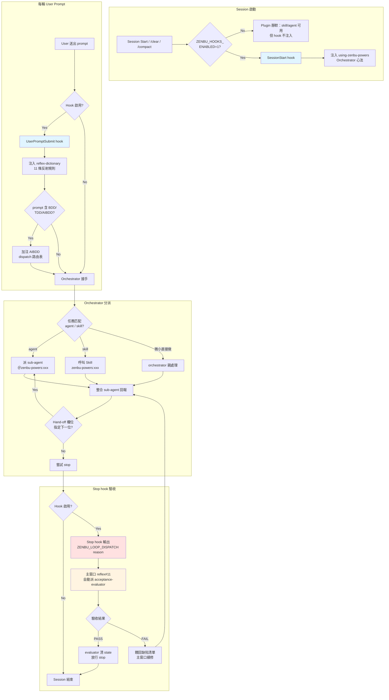
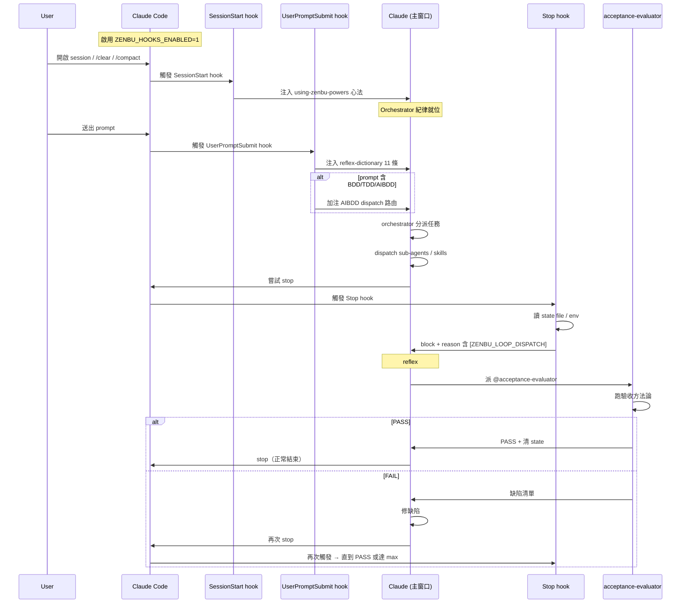
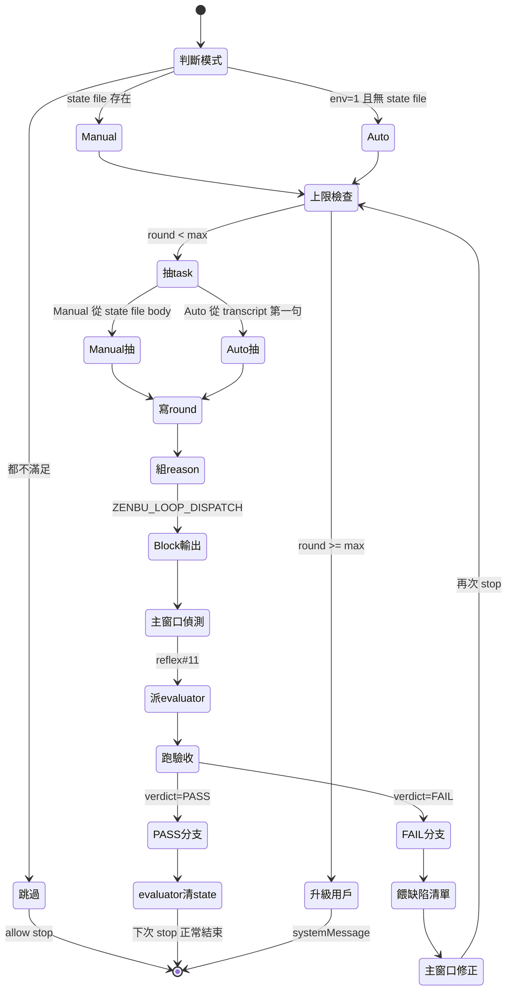

# zenbu-powers — Claude Code Plugin

> 為 **zenbu org** 量身打造的 Claude Code Plugin。內建 Orchestrator 心法注入、23 個專業 Agent、99 個 Skill，覆蓋 WordPress 全棧、React / NestJS / Node.js 現代應用、AIBDD 行為驅動開發三大領域，讓 AI 工程師團隊從第一個 session 就知道如何分工。

**v3.13.1** — 三層 Hook 架構（SessionStart 注心法、UserPromptSubmit 注 reflex、Stop hook 自驅動 acceptance loop）、Auto Loop opt-in、acceptance-evaluator 收斂為 Stop hook 單路徑（H2 重構：agent type → command type）、reflex-dictionary 11 條每輪反射規則、AIBDD 條件式注入；AIBDD 三語言整合測試（TypeScript / PHP / C#）完整覆蓋。

---

## 設計哲學

```
你（使用者）
    │
    ▼
Orchestrator（Claude 主窗口）
    │  分析需求、拆解子任務、整合報告
    ├──► Agent Team（平行或序列委派）
    │        ├── wordpress-master      ← PHP / WP 實作
    │        ├── react-master          ← React / TSX 實作
    │        ├── nestjs-master         ← NestJS / TypeScript 實作
    │        ├── security-reviewer     ← 資安審查
    │        ├── acceptance-evaluator  ← 驗收標準對齊（Stop hook 自動派）
    │        └── ...（共 23 個）
    │
    └──► Skills（流程 / 知識 / Library 參考）
             ├── /brainstorming     ← 設計精進
             ├── /tdd-workflow      ← Red→Green→Refactor
             ├── /aibdd-*           ← AIBDD 全自動 BDD 套件
             └── ...（共 99 個）
```

**三層 Hook 架構**讓「協調紀律」在第一輪 prompt 之前就到位：

1. **SessionStart hook** — session 啟動 / `/clear` / `/compact` 時注入 `using-zenbu-powers` 的完整 Orchestrator 心法（Agent 索引、Skill 快取、Red Flags、全域一致性守則）
2. **UserPromptSubmit hook** — 每次送 prompt 注入 reflex-dictionary 11 條反射規則；命中 `BDD/TDD/AIBDD` 觸發詞時加注 AIBDD dispatch 路由
3. **Stop hook** — 主窗口嘗試結束時，輸出 `[ZENBU_LOOP_DISPATCH]` reason 觸發 `@acceptance-evaluator` 驗收；FAIL 把缺陷清單餵回繼續修，PASS 才放行 stop

整套機制由 `ZENBU_HOOKS_ENABLED=1` 環境變數**顯式啟用**（v3.13.1 起改回 opt-in，避免干擾未準備好的 user）。

---

## 整體運作流程



---

## 安裝方式

### 從 Marketplace 安裝

```bash
claude plugin marketplace add zenbuapps/zenbu-powers
claude plugin install zenbu-powers
```

### 從本地目錄安裝

```bash
claude plugin install ./zenbu-powers
```

### 更新 / 移除

```bash
claude plugin update zenbu-powers@zenbu-powers
claude plugin uninstall zenbu-powers
```

### 驗證安裝

```bash
claude plugin list   # 列出已安裝的 Plugin
/skills list         # 列出可用的 Skill
/agent               # 列出可用的 Agent
```

### 啟用 Hook（必要）

zenbu-powers 的核心紀律仰賴 hook 注入，**預設不啟用**。在 `~/.claude/settings.json` 加：

```json
{
  "env": {
    "ZENBU_HOOKS_ENABLED": "1"
  }
}
```

設定後重啟 session 即可。未啟用時，agents / skills 仍可手動呼叫，但 SessionStart / UserPromptSubmit / Stop hook 不會運作（也就沒有自動驗收 loop）。

---

## Agents（23 個）

### WordPress / PHP

| Agent | 說明 |
|---|---|
| `wordpress-master` | 資深 WordPress / PHP 工程師，外掛、主題、WooCommerce、REST API |
| `wordpress-reviewer` | WP 程式碼審查，確保符合 WPCS 編碼標準與最佳實踐 |

### React / Frontend

| Agent | 說明 |
|---|---|
| `react-master` | React 18 / TypeScript，Refine、Ant Design、TanStack Query |
| `react-reviewer` | React 程式碼審查，注重效能、Accessibility、Hooks 設計 |

### NestJS / Node.js

| Agent | 說明 |
|---|---|
| `nestjs-master` | NestJS 10+ / TypeScript，模組化架構、DI、Guards、TypeORM/Prisma |
| `nestjs-reviewer` | NestJS 程式碼審查，不通過自動退回 master 形成審查迴圈 |
| `nodejs-master` | Node.js 20+ / TypeScript，RESTful API、BullMQ、Zod、Prisma |

### 架構 / 設計

| Agent | 說明 |
|---|---|
| `planner` | 複雜功能與重構的實作計畫設計師 |
| `clarifier` | 結構化需求訪談，輸出使用者故事與驗收標準 |
| `ddd-architect` | DDD 重構規劃，識別 Code Smell、排序重構步驟 |
| `tdd-coordinator` | 接收 planner 計畫，強制執行 Red→Green→Refactor 迴圈 |

### 測試 / 品質 / 驗收

| Agent | 說明 |
|---|---|
| `browser-tester` | git diff 驅動的瀏覽器模擬測試，錄製影片與截圖 |
| `test-creator` | 通用測試工程師，E2E + 整合測試完整覆蓋 |
| `security-reviewer` | OWASP Top 10、WordPress XSS/SQL Injection/CSRF、依賴漏洞 |
| `acceptance-evaluator` | 驗收標準對齊審查，純做 user-intent alignment、需求覆蓋度、邊界完整性、off-topic 偵測；由 Stop hook 統一觸發 |

### DevOps / CI

| Agent | 說明 |
|---|---|
| `workflow-master` | GitHub Actions 製作、除錯、優化，支援 act 本地驗證 |
| `conflict-resolver` | 分析衝突分支意圖，規劃最佳解法後推回各分支 |

### 文件 / 知識管理

| Agent | 說明 |
|---|---|
| `doc-manager` | 協調子代理全面管理 CLAUDE.md、rules、specs 文件體系 |
| `doc-updater` | 功能實作後自動同步 CLAUDE.md 與 rules |
| `lib-skill-creator` | 爬取官方文件，萃取為 API reference 級別的 SKILL |
| `markdown-creator` | 將 PDF/Word/HTML/圖片轉換為高品質 Markdown |
| `claude-manager` | Claude Code 設定最佳實踐審查（CLAUDE.md、settings、hooks、9 大 audit-scope 對齊） |
| `prompt-optimizer` | Prompt 診斷優化與跨用途轉換 |

---

## Skills（99 個）

### Orchestrator 流程與驗收（必讀）

| Skill | 說明 |
|---|---|
| `/using-zenbu-powers` | Orchestrator 心法、Agent/Skill 索引、Red Flags（SessionStart 自動注入） |
| `/brainstorming` | Socratic 對話精煉需求 + HARD-GATE（未獲批准禁止實作） |
| `/dispatching-parallel-agents` | 何時並行派 agent、何時必須序列化的判斷規範 |
| `/clarify-loop` | 需求釐清迴圈 |
| `/plan` | 任務分解與實作規劃 |
| `/systematic-debugging` | 4 階段根因調查，含 WP / React / AIBDD 常見 bug 對照表 |
| `/tdd-workflow` | Red → Green → Refactor 執行 playbook，含 Evidence 鐵律 |
| `/finishing-branch` | Merge / PR / Keep / Discard 決策樹 + worktree 清理 |
| `/acceptance-evaluation` | 驗收標準對齊評估方法論（零假設驗收前置鐵律、多階段任務驗收規範） |

### AIBDD — AI 行為驅動開發（全自動 BDD 套件，17 個 skill）

AIBDD 是 zenbu-powers 的核心差異化能力。從 BDD 分析到整合測試，全程由 skill 驅動，支援 **TypeScript / PHP / C#** 三種語言。

#### 分析與設計（11 個）

| Skill | 說明 |
|---|---|
| `/aibdd-kickoff` | AIBDD 開發啟動儀式 |
| `/aibdd-discovery` | 行為發現與 Domain 探索（Phase 01：composition → flow → behavior） |
| `/aibdd-core` | AIBDD 核心概念與架構（reconciler contract reference） |
| `/aibdd-specformula` | Spec 撰寫公式（需求層級全流程工程計畫產生器） |
| `/aibdd-form-feature-spec` | Feature Spec 表單（Gherkin Feature File） |
| `/aibdd-form-entity-spec` | Entity Spec 表單（DBML 資料模型） |
| `/aibdd-form-api-spec` | API Spec 表單（OpenAPI） |
| `/aibdd-form-bdd-analysis` | BDD 分析表單（句型模型、覆蓋矩陣） |
| `/aibdd-form-activity` | Activity 設計表單（Mermaid 流程圖） |
| `/aibdd-composition-analysis` | 組成分析（KICKOFF / CHANGE 雙模式） |
| `/aibdd-consistency-analyzer` | 一致性驗證 |

#### 通用自動化（6 個，語言無關）

| Skill | 說明 |
|---|---|
| `/aibdd-auto-tdd` | TDD 自動化統一入口（紅燈 / 綠燈 / 重構 / control-flow / starter）—— 8 stage × 3 語言（C# / PHP / TS）雙軸路由樞紐 |
| `/aibdd-handlers` | 6 類 Handler（Command / Query / Aggregate-Given / Aggregate-Then / ReadModel-Then / Success-Failure）統一參考 |
| `/aibdd-carry-on-engineering-plan` | 續接工程計畫 |
| `/aibdd-auto-frontend-nextjs-pages` | Next.js 頁面自動化 |
| `/aibdd-auto-frontend-msw-api-layer` | MSW API 層自動化 |
| `/aibdd-auto-frontend-apifirst-msw-starter` | API First MSW 起手式 |

### WordPress（19 個）

| Skill | 說明 |
|---|---|
| `/wp-plugin-development` | 外掛架構、Hooks、Settings API、安全性、打包發佈 |
| `/wp-block-development` | 靜態/動態區塊、block.json、Inner Blocks |
| `/wp-block-themes` | FSE Block Theme、theme.json、Templates、Patterns |
| `/wp-interactivity-api` | Directives、Server-Side Rendering |
| `/wp-rest-api` | 自訂端點、身份驗證、Custom Post Types |
| `/wp-performance` | 資料庫查詢、物件快取、Autoload 優化 |
| `/wp-abilities-api` | 角色與權限管理 |
| `/wp-wpcli-and-ops` | 自動化部署、Multisite、資料庫操作 |
| `/wp-phpstan` | 靜態分析設定、WordPress 型別標註 |
| `/wp-playground` | 沙盒環境、Blueprint 設定 |
| `/wp-testing` | WordPress Plugin 測試統一入口（E2E + Integration；含決策樹） |
| `/wp-project-triage` | WP 專案健康檢查 |
| `/wp-mcp-adapter` | WP MCP 適配器 |
| `/wordpress-router` | 前端路由決策樹 |
| `/wordpress-standards` | WordPress 規範統一入口（coding / review checklist / security checklist 三視角） |
| `/woocommerce-hpos` | WooCommerce HPOS 高效能訂單存儲 |
| `/wpds` | WordPress 元件設計系統 |
| `/vite-for-wp-v0-12` | Vite for WordPress |
| `/powerhouse-v3-3` | Powerhouse v3.3 |

### React / 前端框架（22 個）

| Skill | 說明 |
|---|---|
| `/react-coding-standards` | React / TypeScript 最佳實踐 |
| `/react-review-criteria` | React 審查標準 |
| `/react-master` | React 開發主技能 |
| `/react-router` | React Router（依 package.json 自動切 v6 / v7） |
| `/refine` | Ant Design + Refine 框架開發（依 package.json 自動切 v4 / v5） |
| `/antd-v5` | Ant Design v5 元件庫 API 參考 |
| `/antd-toolkit` | antd-toolkit (j7-dev/antd-toolkit) WP / Refine 整合元件 |
| `/ant-design-pro-v2` | Ant Design Pro Components（ProTable / ProForm 等） |
| `/react-flow-v12` | React Flow 流程圖 |
| `/tanstack-query` | TanStack Query 資料請求（依 package.json 自動切 v4 / v5） |
| `/jotai-v2` | Jotai 原子化狀態管理 |
| `/frontend-design` | 前端設計原則 |
| `/zenbu-design-system` | Zenbu 設計系統 |
| `/blocknote-v0-30` | BlockNote 富文本編輯器 |
| `/i18next-v25` | i18next 國際化 |
| `/vidstack-hls-v1` | Vidstack HLS 影片播放 |
| `/tailwindcss` | Tailwind CSS（依 package.json 自動切 v3 / v4） |
| `/pdf-lib-v1-17` | PDF 操作 |
| `/next-intl-v4` | next-intl 國際化 |
| `/nextjs` | Next.js（依 package.json 自動切 v15 / v16） |
| `/react-hook-form-v7` | React Hook Form v7 |
| `/tiptap-v2` | Tiptap 富文本編輯器 |

### NestJS / Node.js / 後端（11 個）

| Skill | 說明 |
|---|---|
| `/nestjs-v11` | NestJS 11 開發參考 |
| `/nestjs-coding-standards` | NestJS 編碼標準 |
| `/nestjs-review-criteria` | NestJS 審查標準 |
| `/nodejs-master` | Node.js 開發主技能 |
| `/typeorm-v0-3` | TypeORM v0.3 |
| `/drizzle-orm-v0-38` | Drizzle ORM v0.38 |
| `/bullmq-v5` | BullMQ v5 任務佇列 |
| `/zod-v3` | Zod v3 資料驗證 |
| `/better-auth-v1-4` | Better Auth v1.4 |
| `/stripe-node-v22` | Stripe Node.js SDK v22 |
| `/docker-compose` | Docker Compose |

### DevOps / CI / 工具（7 個）

| Skill | 說明 |
|---|---|
| `/github-actions` | GitHub Actions 工作流程 |
| `/workflow-master` | CI/CD pipeline 製作與除錯 |
| `/claude-code-action` | Claude Code GitHub Action |
| `/cloudflare-pages-wrangler` | Cloudflare Pages 部署 |
| `/octokit-rest-v21` | Octokit REST API |
| `/issue-creator` | GitHub Issue 自動建立 |
| `/aho-corasick-skill` | 批次字串掃描（全域一致性必用） |

### Agent Playbook / 品質（10 個）

> 這些 skill 是 agent 的「工作手冊」，由對應 agent 載入運作，也可獨立呼叫。

| Skill | 說明 |
|---|---|
| `/wordpress-master` | wordpress-master agent playbook |
| `/react-master` | react-master agent playbook |
| `/nodejs-master` | nodejs-master agent playbook |
| `/browser-tester` | browser-tester agent playbook |
| `/conflict-resolver` | conflict-resolver agent playbook |
| `/lib-skill-creator` | lib-skill-creator agent playbook |
| `/markdown-creator` | markdown-creator agent playbook |
| `/claude-manager` | claude-manager agent playbook（9 大 audit-scope） |
| `/ddd-refactoring` | DDD 重構 playbook |
| `/test-creation-playbook` | 測試建立 playbook |

### 工作流程（8 個）

| Skill | 說明 |
|---|---|
| `/git-commit` | 產生符合慣例的 Commit Message |
| `/finishing-branch` | 分支收尾決策樹 |
| `/conflict-resolver` | 衝突解決流程 |
| `/prompt-optimization` | Prompt 優化 |
| `/notebooklm` | NotebookLM 知識庫整合 |
| `/nuwa` | Agent 工廠（依黃金法則創建薄殼 Agent + Skills） |
| `/doc-sync-playbook` | 文件同步 playbook |
| `/doc-scaffolding-workflow` | 文件鷹架建立流程 |

---

## Slash Commands（6 個）

zenbu-powers 直接註冊 6 個 slash command：

| Command | 用途 |
|---|---|
| `/zenbu-loop <task> [--max <n>]` | 啟動 Manual Loop（顯式驗收迴圈） |
| `/zenbu-loop-status` | 查當前 Loop 狀態（Auto / Manual / round_count / 任務內容） |
| `/zenbu-loop-cancel` | 取消 Manual Loop（不影響 Auto Loop） |
| `/ide-on` | 啟用 IDE MCP（讀 VS Code selection / diagnostics） |
| `/ide-off` | 停用 IDE MCP |
| `/ide-status` | 查 IDE MCP 啟用狀態 |

---

## Hook 三層架構詳解

### Hook 啟用順序



### 1. SessionStart Hook — 注入 Orchestrator 心法

**觸發**：session 啟動、`/clear`、`/compact` 時各執行一次。

**動作**：執行 `hooks/run-hook.cmd session-start` → 注入 `using-zenbu-powers` SKILL 全文（Agent 索引、Skill 索引、Red Flags、全域一致性守則等）。

**跨平台輸出**：透過 polyglot wrapper 自動偵測 IDE，輸出對應 JSON 格式：
- **Claude Code** — 標準 `hookSpecificOutput.additionalContext`
- **Cursor** — `additional_context` 欄位
- **Copilot CLI** — SDK 標準 `additionalContext` 欄位
- **Windows** — `cmd.exe` 解析，自動偵測 Git Bash
- **macOS / Linux** — bash 直接執行

若環境無 bash，hook silent exit 0，plugin 其餘功能不受影響。

### 2. UserPromptSubmit Hook — 每輪反射 + AIBDD 條件式

**觸發**：每次 user 送 prompt 時。

**動作**：合併輸出兩段 context（同一個 `additionalContext` 字串）：

1. **Reflex Dictionary（無條件）** — `hooks/reflex-dictionary.txt` 的 11 條協調紀律：
   - ① 命名規範 ② orchestrator 角色 ③ 自主決策 ④ 鏈式委派 ⑤ 驗收紀律 ⑥ 第一性原理 default-on ⑦ 不中途停下 ⑧ WHAT vs HOW ⑨ Skill 優先順序 ⑩ 批次驗收 fetch ⑪ **Stop hook dispatch fetch（v3.13 新增）**
2. **AIBDD 模式（條件式）** — `hooks/aibdd-mode-prompt.txt` 的 dispatch 路由表，僅當 prompt 含 `AIBDD` / `BDD` / `TDD` 觸發詞時注入

**AIBDD 觸發判斷**：
- **關鍵字**：`AIBDD` / `BDD` / `TDD`
- **比對規則**：word boundary（`\b...\b`）＋ case-insensitive
- **覆寫詞先命中時整段跳過**：`直接 / 自己來 / 跳過 skill / 不要 BDD / 先 patch / skip BDD` 等

**AIBDD 三條 dispatch 路由**：

| 情境 | 派發目標 |
|---|---|
| 全流程（預設） | `@zenbu-powers:clarifier` → 規格化 + 紅綠重構鏈 |
| 僅 Phase 01 拆解 | `zenbu-powers:aibdd-discovery` skill |
| 僅 TDD 紅綠重構 | `@zenbu-powers:tdd-coordinator` |

### 3. Stop Hook — 驅動 acceptance loop（v3.13 核心新機制）

**觸發**：主窗口嘗試 stop 時。

**架構**：v3.13 H2 重構後，Stop hook 從 agent type 改為 **command type 純 shell 腳本**。職責分工：

- **Shell 腳本（hook 本身）**：deterministic 部分——啟用判定、round_count 管理、組 dispatch reason、上限保護
- **主窗口 reflex #11**：偵測 reason 內 `[ZENBU_LOOP_DISPATCH]` token → 自動派 `@acceptance-evaluator`
- **acceptance-evaluator agent**：跑驗收方法論、PASS 時自行清 state（讓 evaluator 同時負責驗收與終止 loop）

#### Loop 狀態機



#### 兩種啟用方式

| 維度 | **Auto Loop** | **Manual Loop** |
|---|---|---|
| 啟用條件 | `ZENBU_HOOKS_ENABLED=1` env | 跑 `/zenbu-loop <task>` |
| 觸發 source | env 變數 + transcript 第一個 user message 當 task | `.claude/zenbu-loop.local.md` state file 存在 |
| max_rounds | **10**（hard-coded） | `--max <n>`（預設 10，0 = unlimited） |
| 任務來源 | transcript 第一個 user message | state file body 的 task 全文（更可靠） |
| PASS 處理 | evaluator 重置 round_count | evaluator 重置 + 刪除 state file（自動退出） |
| 終止路徑 | evaluator PASS / 達 10 輪 FAIL 升級 | evaluator PASS / 達 max FAIL 升級 / `/zenbu-loop-cancel` |

**啟用優先順序**：state file 存在 → Manual；否則檢查 env → Auto；都無 → allow stop。

#### Loop 使用情境

**情境 1：日常開發開全域品質把關（Auto Loop）**

最常用——`~/.claude/settings.json` 加 env。每次 session 嘗試 stop 都會跑 evaluator 驗收。Master 偷懶 → FAIL → 餵回缺陷清單 → 主窗口繼續修。10 輪保護不會無限循環。

**情境 2：明確 task 走 Manual Loop**

```bash
/zenbu-loop "把 PR #123 的 conflict 解掉並通過 CI"
```

不論 env 是否開，hook 都會啟動，max=10。Manual Loop 從 state file body 抽 task（比 Auto 從 transcript 抽更可靠）。

**情境 3：長時間重構放寬 max**

```bash
/zenbu-loop "重構整個 auth 模組到 DDD 架構" --max 30
# 或短形式
/zenbu-loop "重構 X 模組" -m 30
```

**情境 4：BDD 全流程不間斷推進**

```bash
/zenbu-loop "依 specs/feature-X.feature 跑完 red → green → refactor 全流程" --max 50
```

搭配 `aibdd-*` skill 系列，evaluator 把關每個 phase 邊界完成度。

**中途操作**：

```bash
/zenbu-loop-status    # 查當前 Auto / Manual 狀態 + round_count + 任務
/zenbu-loop-cancel    # 取消 Manual Loop（不影響 Auto Loop）
```

#### 設計理念

- **終止只信 evaluator**：不提供 LLM 自喊「完成」的訊號——避免主窗口繞過驗收
- **Manual 優先 env**：state file 存在就走 Manual 設定，沒設 env 的用戶仍能用品質 loop
- **與 ralph-wiggum 不相容**：兩 plugin 都註冊 Stop hook，請擇一啟用
- **批次協定 v2**（v3.10+）：evaluator FAIL 缺陷過多時寫入 `.claude/zenbu-loop-reports/<id>.md`，reason 只放 top 3 摘要；reflex 第 10 條強制主窗口 Read 完整報告，避免 context 爆炸

> **別跟 reviewer agent loop 混淆**：master/reviewer 之間的「最多 3 輪退件」是程式碼審查迴圈；這裡的「Stop hook max」是 acceptance-evaluator 對主窗口整體產出的驗收輪數（Auto 10 / Manual 自訂）——兩條是不同層次的上限，會同時在運作。

完整規範：`hooks/stop-hook-spec.md` ・ Mode 對照與 edge cases：`skills/using-zenbu-powers/references/acceptance-loop.md`

---

## 核心紀律（v3.13.1）

zenbu-powers 在 v3.6 之後逐步引入下列紀律，由 SessionStart hook 與 reflex-dictionary 強制注入，所有 agent / orchestrator 均受其約束：

### 鏈式委派（Chained Delegation）

Sub-agent 回報後，主窗口讀取「Hand-off / Next Agent」標示自動 dispatch 下一位，不停下問用戶。Reviewer 退回時 orchestrator 扛中繼。預設純 sub-agent 鏈式委派，不開 Teams / Worktree。

### 自主決策授權（v3.7）

遇到多個合理方案時，Orchestrator **必須自選一個並推進**，不得把選擇題丟回給用戶。決策 heuristic：與既有架構一致 → 可逆性高 → 最小驚訝 → 保守優先 → 資訊充足者勝。三類窄門例外（不可逆操作確認 / 用戶獨有資訊 / 3 輪 FAIL 升級）才暫停回報。

### 零假設驗收前置鐵律（v3.8）

驗收（acceptance evaluation）禁止以「沒看到問題就沒問題」為預設——必須執行**反向訊號優先掃描**，從失敗模式、邊界條件、off-topic 偵測切入，達標才能 PASS。詳見 `/acceptance-evaluation` skill。

### 多階段任務驗收（v3.11）

`@acceptance-evaluator` 強化規範：**禁止局部完成判定為 PASS**。Multi-phase / step / stage 任務必須跨邊界自動續推，全部跑完並驗收完才回報用戶。

### Acceptance 統一由 Stop hook 驅動（v3.13.0）

H2 重構：原本 orchestrator 「派 evaluator」散落多處，現在收斂為 **Stop hook 單路徑**。Sub-agent 回報後 orchestrator **不主動** dispatch evaluator；最終 stop 時由 hook 輸出 `[ZENBU_LOOP_DISPATCH]` reason，reflex #11 統一觸發 evaluator。窄門例外：用戶 prompt 含「驗收 / 評估 / final check」明確關鍵詞、或多 agent 整合 conflict 想做 sanity check 時可中段提早派一次。

### Auto Loop opt-in（v3.13.1）

`ZENBU_HOOKS_ENABLED=1` 需顯式設定才啟用 Auto Loop（與 SessionStart / UserPromptSubmit hook 共用 env 變數）。未設 env 的用戶仍可透過 `/zenbu-loop <task>` 走 Manual Loop。

### Reviewer Agent Loop 上限

Reviewer 退回 master 修正 → master 修完再送 reviewer 複審。**最多 3 輪**，第 3 輪仍未過才主動升級用戶裁決。

---

## MCP Servers

| MCP Server | 說明 |
|---|---|
| Serena | 程式碼語意搜尋，快速定位引用關係與符號 |

> 💡 **為什麼沒有 Playwright MCP？** zenbu-powers 的瀏覽器自動化統一改用 **`playwright-cli` SKILL**（直接呼叫 CLI），不走 MCP server。這樣做的好處：啟動快、無需常駐 process、跨平台穩定、debug 時可直接在終端重現指令。`browser-tester`、`test-creator`、`markdown-creator` 等 agent 皆已改用此模式。

---

## 專案結構

```
zenbu-powers/
├── .claude-plugin/
│   ├── plugin.json            # Claude Code Plugin 主設定（version=3.13.1）
│   └── marketplace.json       # Marketplace 上架設定
├── hooks/                     # 三層 Hook 架構
│   ├── hooks.json             # SessionStart / UserPromptSubmit / Stop 三 hook 宣告
│   ├── run-hook.cmd           # 跨平台 polyglot wrapper
│   ├── session-start          # SessionStart hook 實作（注入 using-zenbu-powers）
│   ├── user-prompt-submit     # UserPromptSubmit hook 實作（reflex + AIBDD 條件式）
│   ├── stop-hook              # Stop hook 實作（H2 後純 shell command type）
│   ├── reflex-dictionary.txt  # 11 條每輪反射規則
│   ├── aibdd-mode-prompt.txt  # AIBDD dispatch 路由表
│   ├── stop-hook-spec.md      # Stop hook 完整邏輯規範
│   └── zenbu-loop-batch-protocol.md  # FAIL 缺陷分批協定 v2
├── agents/                    # 23 個 Agent 定義檔
│   ├── wordpress-master.agent.md
│   ├── nestjs-master.agent.md
│   ├── acceptance-evaluator.agent.md
│   └── ...
├── skills/                    # 99 個 Skill 定義檔
│   ├── using-zenbu-powers/    # Orchestrator meta-skill（SessionStart 注入）
│   ├── brainstorming/         # Socratic 設計精進 + HARD-GATE
│   ├── acceptance-evaluation/ # 零假設驗收前置鐵律
│   ├── aibdd-*/               # AIBDD 全自動 BDD 套件（18 個）
│   ├── wp-*/                  # WordPress 全棧 skills（19 個）
│   └── ...
├── commands/                  # 6 個 Slash Commands
│   ├── zenbu-loop.md          # 啟動 Manual Loop
│   ├── zenbu-loop-status.md   # 查 Loop 狀態
│   ├── zenbu-loop-cancel.md   # 取消 Manual Loop
│   ├── ide-on.md / ide-off.md / ide-status.md  # IDE MCP 切換
├── scripts/                   # 輔助 Node.js 腳本
│   ├── zenbu-loop-setup.mjs   # /zenbu-loop 後端
│   ├── zenbu-loop-status.mjs  # 狀態查詢
│   ├── zenbu-loop-cancel.mjs  # Manual Loop 取消
│   ├── ide-toggle.mjs         # IDE MCP 切換
│   └── release.sh             # 發版腳本
├── prompts/                   # Prompt 範本
└── .mcp.json                  # MCP Server 設定（目前只有 Serena）
```

---

## 使用範例

安裝完成後（並設定 `ZENBU_HOOKS_ENABLED=1`），Claude 在 session 啟動時已自動載入 Orchestrator 心法。你只需要用**自然語言**描述需求，Claude 會判斷要委派哪個 Agent、呼叫哪個 Skill。無需記憶指令清單。

### 範例 1：開發一個全新 WordPress 外掛

```
我要做一個 WooCommerce 訂單匯出外掛，支援 HPOS，要有 REST API
```

Claude 的自動流程：

1. **`/brainstorming`** — Socratic 對話精煉需求（支援哪些欄位？權限？Rate limit？）
2. **`@clarifier`** — 輸出結構化使用者故事與驗收標準
3. **`@planner`** — 產出實作計畫
4. **`@wordpress-master`** — 依計畫實作，過程中自動參考 `/wp-plugin-development`、`/wp-rest-api`、`/woocommerce-hpos`
5. **`@wordpress-reviewer` + `@security-reviewer`** — 平行審查，不通過退回 master 形成迴圈
6. **嘗試 stop** → Stop hook 自動派 **`@acceptance-evaluator`** 驗收用戶原始需求覆蓋度與邊界完整性，PASS 才放行
7. **`/git-commit`** — 產生符合慣例的 Commit Message

### 範例 2：修一個棘手的 bug

```
正式環境有個 race condition，某個訂單狀態偶爾會跳回舊值
```

Claude 的自動流程：

1. **`/systematic-debugging`** — 啟動 4 階段根因調查（Reproduce → Isolate → Root Cause → Fix & Verify）
2. 依需要委派 **`@wordpress-master`** 或 **`@nestjs-master`** 深入分析
3. 確認根因後才開始修，避免「瞎改到好」

### 範例 3：AIBDD 全自動 BDD 開發（TypeScript 專案）

```
/aibdd-kickoff
```

啟動 AIBDD 儀式後，Claude 依序引導：

1. **`/aibdd-discovery`** → **`/aibdd-form-feature-spec`** → **`/aibdd-form-entity-spec`** → **`/aibdd-form-api-spec`**
2. **`@tdd-coordinator`** 接管，依序透過 `/aibdd-auto-tdd（lang=typescript）` 執行 red → green → refactor 三階段
3. 全程由 skill 約束，確保測試先於實作、測試覆蓋各種 Handler 類型（Command / Query / Aggregate / ReadModel）

### 範例 4：NestJS API 新功能

```
幫我在現有 NestJS 專案加一個使用者通知模組，用 BullMQ 做背景寄信
```

Claude 的自動流程：

1. **`@planner`** — 依現有模組結構產出模組化設計
2. **`@nestjs-master`** — 實作，自動參考 `/nestjs-v11`、`/bullmq-v5`、`/typeorm-v0-3`、`/zod-v3`
3. **`@nestjs-reviewer`** — 審查 DI、Guards、DTO 驗證

### 範例 5：直接叫用特定 Skill 或 Agent

```
/brainstorming 設計一個多租戶權限系統
```

```
@security-reviewer 幫我審查剛剛寫的 REST API 端點
```

```
/finishing-branch
```

### 範例 6：跨平台一致性重構

```
把所有提到 old-plugin-name 的地方，全部改成 new-plugin-name
```

Claude 自動套用**全域一致性守則**：

1. **`/aho-corasick-skill`** `scan` 模式批次掃描所有命中
2. 逐一替換
3. 重新掃描確認零殘留

### 範例 7：明確 task 走 Manual Loop 把關

```
/zenbu-loop "把 PR #123 的 conflict 解掉並通過 CI" --max 20
```

任務交給 Claude 後不管講「我以為完成了」或「碰到瓶頸」都會被 Stop hook 攔下跑 evaluator 驗收。20 輪內反覆驗收，PASS 才退出 Manual Loop；超過才升級用戶裁決。

---

## 常見問題（FAQ）

### Q1：已經安裝 `obra/superpowers`，還需要裝 zenbu-powers 嗎？反過來呢？

**答：不建議同時安裝。** zenbu-powers 已完整涵蓋 superpowers 的核心方法論（`systematic-debugging`、`finishing-branch`、`tdd-workflow` 的 verification-gate、SessionStart hook 架構、`brainstorming`、`dispatching-parallel-agents`），並在此基礎上擴充為 zenbu org 的完整技術棧（WordPress 全棧 / React 生態 / NestJS / AIBDD 三語言整合測試）。

兩者同時安裝會導致：
- **Skill 命名衝突** — 同名 skill 行為可能差異
- **SessionStart hook 重複觸發** — context 被注入兩次
- **Stop hook 衝突** — 兩 plugin 都註冊 Stop hook，會交叉攔截
- **Agent 職責重疊** — Claude 判斷該派誰時會猶豫

**建議**：直接用 zenbu-powers 即可，已經是 superpowers 的超集。

### Q2：我只寫 React / Node.js，用不到 WordPress，裝這個會不會太肥？

**答：不會影響。** Skill 是**被動載入**的——只有 Claude 判斷當前任務需要時才會讀取對應 skill 的內容，不會佔用你的 context。你寫 React 時，`wp-*` skills 就只是硬碟上的檔案，完全不會干擾。

### Q3：Hook 沒觸發怎麼辦？

**答：** 依以下順序檢查：

1. 確認已啟用 hook：`~/.claude/settings.json` 的 `env` 區塊需有 `"ZENBU_HOOKS_ENABLED": "1"`
2. 確認 plugin 已正確安裝：`claude plugin list`
3. Windows 使用者確認有裝 Git Bash（hook 需要 bash 解析）
4. 重新啟動 Claude Code / Cursor / Copilot CLI session
5. Hook 會依執行環境自動切換 JSON 輸出格式；若使用其他不在支援列表的 IDE 平台，可能無法注入
6. 若仍無效，可手動執行 `/using-zenbu-powers` 載入 Orchestrator 心法

### Q4：如何新增自己專案專屬的 Agent 或 Skill？

**答：** zenbu-powers 是**全域 plugin**，放置共用能力。專案專屬的 agent / skill 應放在專案根目錄：

```
專案根目錄/
├── .claude/
│   ├── agents/          # 專案專屬 agent
│   ├── skills/          # 專案專屬 skill
│   ├── rules/           # 專案專屬規則
│   └── CLAUDE.md        # 專案說明
```

若要建立新 skill，呼叫 `@lib-skill-creator` 自動爬取官方文件並產出 API reference 級別的 SKILL.md。若要建立新 agent，呼叫 `/nuwa` 依黃金法則自動產出薄殼 agent + 配套 skills。

### Q5：Claude 沒有自動委派 Agent，一直自己寫 code，怎麼辦？

**答：** 通常是 hook 沒成功注入。可以：

1. 確認 `ZENBU_HOOKS_ENABLED=1` 已設且 session 已重啟
2. 手動執行 `/using-zenbu-powers` 重新載入心法
3. 在對話中明確提醒：「請以 orchestrator 模式處理，委派給合適的 agent」
4. 直接 `@<agent-name>` 點名（例如 `@wordpress-master 幫我實作這個功能`）

### Q6：AIBDD 是什麼？跟一般 TDD 有何不同？

**答：** AIBDD（AI Behavior-Driven Development）是 zenbu-powers 獨家設計的 AI 驅動 BDD 方法論：

- **一般 TDD** — 工程師手寫測試 → 手寫實作 → 手動重構
- **AIBDD** — 透過表單（feature / entity / api spec）結構化需求 → AI 依 skill 自動產生失敗測試 → 自動實作 → 自動重構

差別在於 AIBDD 有**完整的 skill 約束**確保 AI 不會偷跑、不會跳步，且支援 TypeScript / PHP / C# 三語言的 Handler 模式（Command / Query / Aggregate / ReadModel）。

### Q7：可以只用 Skill 不用 Agent 嗎？反之？

**答：可以。** 兩者獨立運作：

- **只用 Skill** — Claude 以主窗口身份執行，參考 skill 的知識，適合小型任務
- **只用 Agent** — 直接 `@<agent>` 點名委派，skip 掉 Orchestrator 的判斷流程

但**建議讓 Orchestrator 自動判斷**，通常選擇最優。

### Q8：MCP Server 跟 playwright-cli SKILL 差在哪？一定要裝嗎？

**答：** zenbu-powers 目前只依賴 **Serena MCP**（程式碼 symbol 搜尋），**不再使用 Playwright MCP**。

- **瀏覽器自動化** → 改用 `playwright-cli` SKILL，直接呼叫 CLI 指令。優勢：啟動快、無常駐 process、跨平台穩定、debug 可在終端重現
- **程式碼 symbol 搜尋** → 使用 Serena MCP。若不用 `@ddd-architect` 或大型重構功能，不裝也可以，其餘 skill / agent 不受影響

第一次使用 `playwright-cli` 時會自動下載 Playwright runtime，之後執行會很快。

### Q9：更新 plugin 後，原本的設定會不會被覆蓋？

**答：不會。** `claude plugin update` 只更新 plugin 本身的 agent / skill / hook 定義，不影響：

- 使用者的 `~/.claude/` 個人設定
- 專案的 `.claude/` 專案設定
- 聊天紀錄與 memory

### Q10：Auto Loop / Manual Loop 哪個適合我？

**答：**

- **Auto Loop（`ZENBU_HOOKS_ENABLED=1`）** — 適合「想讓每次 session 都受 evaluator 監督」。task 自動從 transcript 第一個 user message 抽，10 輪上限。
- **Manual Loop（`/zenbu-loop <task>`）** — 適合「明確 task 範圍、需要自訂 max、或沒啟 env」。task 從 state file body 抽（最可靠）。
- **兩者可同時運作** — Manual Loop 優先於 Auto Loop（state file 存在時忽略 env）。

### Q11：遇到 bug 或想提需求？

**答：** 到 [GitHub Issues](https://github.com/zenbuapps/zenbu-powers/issues) 開 issue，或直接發 PR。

---

## 致謝

`systematic-debugging`、`finishing-branch`、`tdd-workflow` 的 verification-gate 設計，以及 SessionStart hook 架構（polyglot wrapper、多 IDE 平台輸出適配），方法論承襲自 [obra/superpowers](https://github.com/obra/superpowers)，並在地化為 zenbu org 的技術棧場景。zenbu-powers 在此基礎上擴充自主決策授權、零假設驗收鐵律、acceptance-evaluator 多階段驗收紀律、Stop hook 自驅動 acceptance loop（v3.13 H2 重構），以及 AIBDD 三語言（TypeScript / PHP / C#）整合測試套件。

---

## 作者

- **j7-dev** — [j7.dev.gg@gmail.com](mailto:j7.dev.gg@gmail.com)
- GitHub: [https://github.com/zenbuapps/zenbu-powers](https://github.com/zenbuapps/zenbu-powers)

## 授權

MIT License
