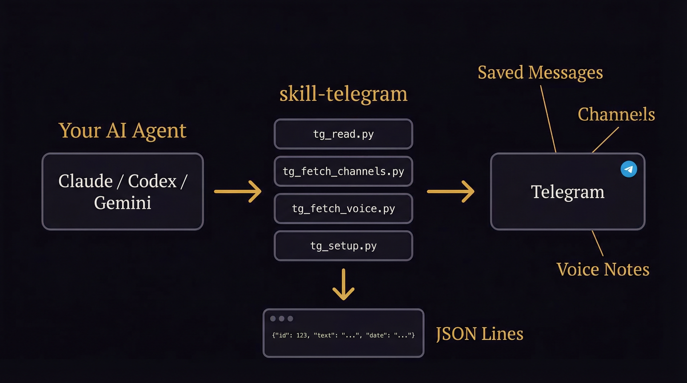

<div align="center">


# telegram-api

**The only Telegram skill your AI agent needs.**

*Read messages. Parse channels. Download voice notes. One session, zero bots.*

</div>

---

## Why

Your AI agent can't read your Telegram. It can't check what you saved, parse industry channels, or process voice messages you recorded on the go. This skill gives it direct access via the Telegram user API — the same way you use Telegram, not through a limited bot.

One session file. All your chats. JSON output that pipes into anything.

<div align="center">

</div>

---

## What It Does

- **Reads any chat** — Saved Messages, DMs, groups, public channels → JSON lines
- **Parses channels at scale** — multiple channels, date filtering, sanitized output with anti-injection protection
- **Downloads voice notes** — audio files + metadata, ready for transcription
- **Diagnostics built in** — one command checks env vars, session, dependencies, connectivity
- **Portable** — works from any directory. Session auto-discovered or explicitly pointed to

## Setup (5 minutes)

### Step 1: Get Telegram API credentials

1. Go to https://my.telegram.org/apps
2. Log in with your phone number
3. Create an app (any name/description)
4. Copy `api_id` and `api_hash`

### Step 2: Configure environment

Add to your `.env` file:
```bash
TG_API_ID=12345678
TG_API_HASH=your_api_hash_here
```

### Step 3: Install dependency

```bash
pip install telethon
```

### Step 4: Authenticate

```bash
source .env && python3 .claude/./scripts/tg_setup.py --auth
```

Enter your phone number → receive code in Telegram → enter code. Done. Session file created automatically.

### Step 5: Verify

```bash
source .env && python3 .claude/./scripts/tg_setup.py
```

All checks should show `[ OK ]`.

## Usage

| You say | What happens |
|---------|-------------|
| "Read my saved messages" | `tg_read.py --saved-messages` → last 10 messages as JSON |
| "Check channel SEOBAZA" | `tg_fetch_channels.py --channel SEOBAZA` → sanitized JSONL |
| "Parse these 5 channels since March 1" | `tg_fetch_channels.py --channels A,B,C,D,E --since 2026-03-01` |
| "Download my voice notes" | `tg_fetch_voice.py --saved-messages` → audio files + metadata |
| "What did someone write me" | `tg_read.py --chat username` → recent messages |

## Output Format

All scripts output **JSON lines** (one JSON object per line):

```json
{"id": 265894, "date": "2026-03-19T09:42:48+00:00", "text": "Message content here", "has_voice": false, "has_photo": false}
```

Channel parser adds sanitization:
```json
{"channel": "SEOBAZA", "id": 1546, "date": "2026-03-19T03:29:34+00:00", "text": "Original", "text_sanitized": "Cleaned", "links": ["https://..."], "hash": "64e9a72207ed56d4", "views": 1403}
```

## Scripts

| Script | Lines | What it does |
|--------|-------|-------------|
| `tg_read.py` | 104 | Read any chat/channel/saved messages → JSON |
| `tg_fetch_channels.py` | 165 | Parse channels with sanitization → JSONL |
| `tg_fetch_voice.py` | 219 | Download voice/audio/video notes |
| `tg_setup.py` | 198 | Auth + full diagnostic |
| `sanitizer.py` | 84 | Anti-injection, emoji cleanup, link extraction |

**Total: 770 lines.** No frameworks, no heavy dependencies. Just Telethon + stdlib.

## Session Resolution

The skill finds your session file automatically:

1. `--session /path/to/file` (CLI flag, highest priority)
2. `TG_SESSION` env var
3. `.claude/data/telegram/tg_session.session` (project-level)
4. `~/.telegram/tg_session.session` (global)

## Security

- **User API** — you authenticate as yourself, not as a bot
- **Session file = your identity** — protect it like a password
- **Read-only** — this skill never sends messages
- **Sanitization** — channel parser strips zero-width chars, backtick injection, excessive emoji
- **No data storage** — outputs to stdout/file, no database, no cloud

## Gotchas

- **First auth is interactive** — you need to enter phone + code once
- **One session at a time** — don't run two scripts with the same session simultaneously
- **Rate limits** — Telegram throttles heavy usage (auto-handled with delays)
- **Voice download ≠ transcription** — the skill downloads audio. Use Whisper/mlx-whisper for transcription
- **User API ≠ Bot API** — this uses your account, sees what you see

## License

MIT — see [LICENSE](LICENSE) for details. Upstream: [awrshift/skill-telegram](https://github.com/awrshift/skill-telegram).

---

<div align="center">
<em>Your agent. Your Telegram. No bots.</em>
</div>
