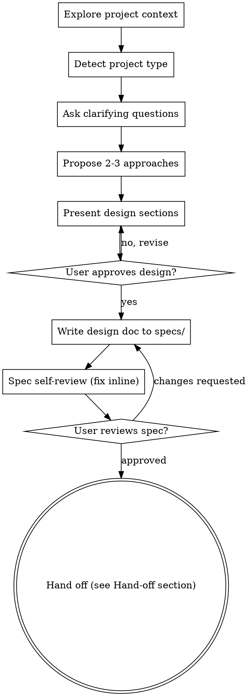

# Brainstorming Ideas Into Designs

Help turn ideas into fully-formed designs and specs through natural collaborative dialogue, then transition cleanly to `/plan` (or the AIBDD chain) for implementation planning.

The flow is fixed: **explore project context → detect project type → ask clarifying questions one at a time → propose 2–3 approaches → present design → user approves → write spec → user reviews spec → hand off**. Do not jump steps.

<HARD-GATE>
Do NOT invoke any implementation skill, write any code, scaffold any project, or take any implementation action until you have presented a design AND the user has approved it. This applies to EVERY project regardless of perceived simplicity — including "just a quick WP plugin tweak" or "just a small React component".
</HARD-GATE>

## Anti-Pattern: "This Is Too Simple To Need A Design"

Every project goes through this process. A tiny WP filter hook, a single Gutenberg block, a WooCommerce tweak, a config change — all of them. "Simple" projects are where unexamined assumptions cause the most wasted work. The design can be short (a few sentences for truly simple projects), but you MUST present it and get approval.

## Checklist

Create a task for each item (use TaskCreate) and complete in order:

1. **Explore project context** — files, `CLAUDE.md`, `.claude/rules/`, recent commits, `composer.json` / `package.json` / `plugin.json`, existing `specs/` directory.
2. **Detect project type** — WP Plugin / WP Theme / Block Theme / React App / Node backend / mixed. For WordPress repos, optionally delegate `/wp-project-triage`.
3. **Scope assessment** — if the request spans multiple independent subsystems, decompose first. Each sub-project gets its own brainstorm → spec → plan cycle.
4. **Ask clarifying questions** — one at a time, multiple-choice when possible. See `references/domain-starters.md` for the highest-leverage opening question per domain.
5. **Propose 2–3 approaches** — with structured trade-offs and a concrete recommendation. See `references/tradeoffs-framework.md`. For complex features, dispatch parallel agents (see below).
6. **Present design** — sections scaled to complexity, get approval after each section. Run through `references/design-patterns.md` mentally before finalising.
7. **Write design doc** — save to `specs/YYYY-MM-DD-<topic>-design.md` and commit (`docs(spec): <topic>`).
8. **Spec self-review** — placeholder scan, internal consistency, scope, ambiguity, domain-specific checks (capability / i18n / HPOS / a11y).
9. **User reviews written spec** — wait for approval; loop back if changes requested.
10. **Hand off** — see Hand-off section. Do not invoke implementation skills directly.

## Process Flow

## The Process

### Understanding the idea

- Read the project state first — never propose without grounding in the actual codebase.
- Ask questions **one at a time**; multiple-choice preferred, open-ended fine when the answer space is genuinely open.
- Focus on: purpose, constraints, success criteria, user persona (for WP: admin? subscriber? shop manager?).
- For domain-specific opening questions and follow-up axes (WordPress / Gutenberg / WooCommerce / React / Node / GraphQL / E2E testing), see `references/domain-starters.md`.

### Exploring approaches (leverage parallel agents)

For complex features, dispatch 2-3 agents in parallel with different focuses:
- **Minimal approach** — smallest change, maximum reuse of existing architecture
- **Clean-slate approach** — redesign for clarity and long-term maintainability
- **Pragmatic approach** — balance speed and quality

Orchestrator consolidates findings and forms a recommendation.

**Orthogonal dimension check**: the 3 approaches MUST differ across at least 2 orthogonal dimensions (not just variations of the same architecture). See `references/tradeoffs-framework.md` for the orthogonal-dimension matrix.

**Recommendation template**:
> Based on [codebase maturity / team size / timeline], recommend [Approach X] because [reason 1], [reason 2] outweigh trade-offs of [Approach Y/Z].

For lighter features the orchestrator can list approaches inline without dispatching — the same orthogonality and recommendation rules still apply.

### Presenting the design

- Once you understand what you're building, present the design.
- Scale each section to its complexity: a few sentences if straightforward, up to 200–300 words if nuanced.
- Ask after each section whether it looks right so far.
- Cover (as applicable): **Architecture**, **Data model**, **UI surface**, **Security model**, **Error handling**, **Testing strategy**.
- Before finalising, run the design through the 10-pattern checklist in `references/design-patterns.md` (extension point, sync vs async, configuration storage, validation layers, state boundary, authorization, migration, observability, failure modes, test seams).

### Design for isolation and clarity

- Break the system into smaller units with one clear purpose, well-defined interfaces, and independent testability.
- For each unit answer: what does it do, how do you use it, what does it depend on?
- WP-specific: can someone disable this plugin cleanly? Can another plugin co-exist without side effects? Is it HPOS-safe?

### Working in existing codebases

- Explore current structure and follow existing patterns (`.claude/rules/*.rule.md`).
- Include **targeted** improvements when existing code blocks the work — don't propose unrelated refactoring.

## After the Design

### Documentation

- Write the validated spec to `specs/YYYY-MM-DD-<topic>-design.md` (user preferences override location).
- Follow the project's existing spec format if one exists.
- Commit with `docs(spec): <topic>`.

### Spec Self-Review

After writing, look at the spec with fresh eyes:

1. **Placeholder scan** — any "TBD", "TODO", incomplete sections, vague requirements? Fix inline.
2. **Internal consistency** — do sections contradict? Architecture matches feature descriptions?
3. **Scope check** — focused enough for a single implementation plan, or needs decomposition?
4. **Ambiguity check** — could any requirement be interpreted two ways? Pick one and make it explicit.
5. **Domain-specific checks** (if applicable):
   - Capability requirements explicit? (`manage_options`, `edit_products`, custom caps)
   - i18n strategy specified? (text domain, `__()` vs `_x()`)
   - HPOS compatibility noted? (for WooCommerce features)
   - Accessibility considered? (front-end / block editor UI)

Fix issues inline. No need to re-review — fix and move on.

### User Review Gate

After the self-review, ask the user to review the written spec:

> "Spec written and committed to `<path>`. Please review it and let me know if you want changes before we hand off."

Wait. If they request changes, make them and re-run the self-review loop. Only proceed once approved.

## Hand-off

After producing `design.md`, route to the appropriate next step:
- **AIBDD spec generation** (produces `.feature` / `api.yml` / `erm.dbml`) → `@zenbu-powers:clarifier`
- **Pure implementation planning** (skip BDD, go straight to coding) → `/plan` skill
- **Single-domain detail clarification** → `zenbu-powers:clarify-loop` skill

Do NOT invoke `/wp-plugin-development`, `/wp-block-development`, `/react-master`, or any implementation skill directly from here.

## Key Principles

- **One question at a time** — don't overwhelm.
- **Multiple choice preferred** — easier than open-ended when feasible.
- **YAGNI ruthlessly** — remove unnecessary features from designs.
- **Explore alternatives** — always 2–3 approaches with orthogonal differences.
- **Incremental validation** — present, get approval, then move on.
- **Be flexible** — go back and clarify when something doesn't make sense.
- **User's CLAUDE.md always wins** — if user rules conflict with this skill, follow user.

## References

- `references/domain-starters.md` — Domain-specific opening questions (WordPress / Gutenberg / WooCommerce / React / Node / GraphQL / E2E testing) with follow-up axes and trade-off tables.
- `references/tradeoffs-framework.md` — Multi-approach trade-off comparison templates, orthogonal-dimension matrix, parallel-agent dispatch template, and recommendation rationale format.
- `references/design-patterns.md` — Cross-domain reusable design patterns (10 patterns) used as a checklist before finalising the design.
