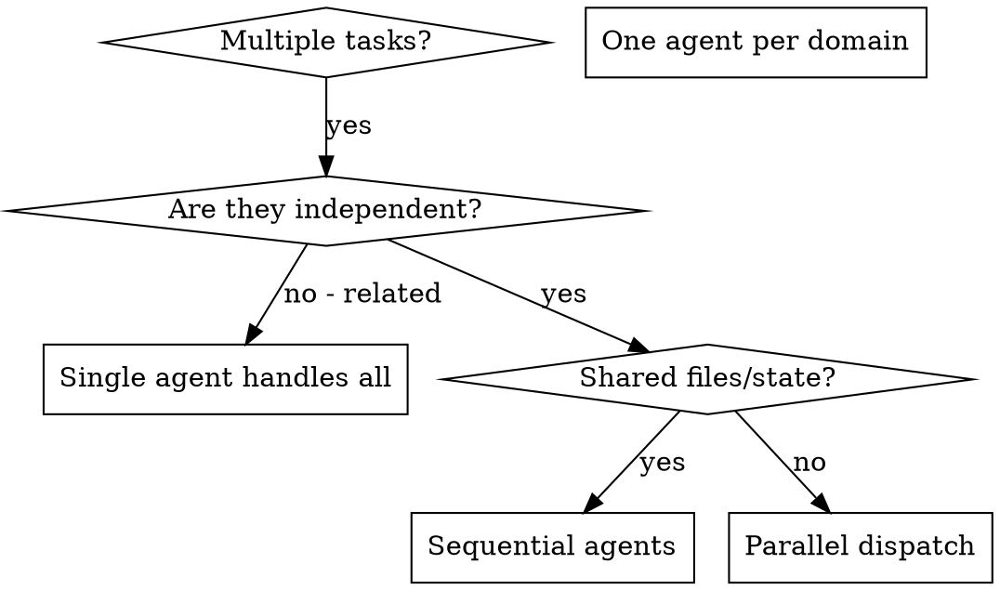

# Dispatching Parallel Agents

## Overview

As the Orchestrator of zenbu-powers, you delegate tasks to specialized agents (`@wordpress-master`, `@react-master`, `@security-reviewer`, etc.) with isolated context. By precisely crafting their instructions and context, you ensure they stay focused and succeed at their task. They should never inherit your session's context or history — you construct exactly what they need. This also preserves your own context for coordination work.

When you have multiple unrelated tasks (different PHP files, different React components, different failing tests, different reviews), handling them sequentially wastes time. Each task is independent and can happen in parallel.

**Core principle:** Dispatch one agent per independent problem domain. Let them work concurrently. **Never share mutable state across parallel agents.**

---

## When to Use



**Use parallel dispatch when:**
- 3+ test files failing with different root causes
- Multiple subsystems broken independently
- Multiple reviewers needed on different files (e.g., `@security-reviewer` on PHP, `@react-reviewer` on TSX)
- Research tasks on different topics (e.g., two Explore agents exploring different areas)
- Each problem can be understood without context from others
- **No shared file writes** between investigations

**Don't use parallel dispatch when:**
- Failures are related (fix one might fix others)
- Need to understand full system state before branching
- Agents would edit the same file(s) — guaranteed merge conflicts
- Results from one agent are inputs to another (that's a pipeline, not parallel)

---

## The Pattern

### 1. Identify Independent Domains

Group tasks by what's affected:
- PHP Plugin core: `@wordpress-master` or `@wordpress-reviewer`
- React admin UI: `@react-master` or `@react-reviewer`
- WC integration: `@wordpress-master` (WC-aware)
- Security posture: `@security-reviewer`
- CI pipeline: `@workflow-master`
- Docs: `@doc-updater`

Each domain is independent as long as the files they touch don't overlap.

### 2. Create Focused Agent Tasks

Each agent gets:
- **Specific scope** — one file, one module, one test file
- **Clear goal** — what "done" looks like
- **Constraints** — "don't change other files", "don't refactor unrelated code"
- **Expected output** — summary of what you found and fixed / what you recommend

### 3. Dispatch in Parallel

Use a single message with multiple Agent tool calls (the CC harness runs them concurrently):

```
Agent(subagent_type: "wordpress-reviewer", ...)                // review PHP files
Agent(subagent_type: "zenbu-powers:react-reviewer", ...)       // review TSX files
Agent(subagent_type: "zenbu-powers:security-reviewer", ...)    // security pass
```

All three run concurrently. (`wordpress-reviewer` 非 plugin 全域常駐，需先在 WordPress 專案執行 `/copy-sets` 複製進 `.claude/`，複製後以無前綴名稱調用。)

### 4. Review and Integrate

When agents return:
- Read each summary
- **Verify edits don't conflict** — did any two agents touch overlapping files?
- Run the full test / lint / type-check suite
- Integrate all changes; if conflicts, resolve with `@conflict-resolver`

---

## Agent Prompt Structure

Good agent prompts are:
1. **Focused** — one clear problem domain
2. **Self-contained** — all context needed to understand the problem (paste error messages, file paths, relevant code excerpts)
3. **Specific about output** — what should the agent return?

Example for zenbu-powers:

```markdown
Review the PHP files changed in this PR for security issues:
- includes/api/class-orders-controller.php
- includes/models/class-order-repository.php

Focus on:
1. Capability checks (should use `current_user_can('edit_shop_orders')`)
2. Nonce verification for state-changing requests
3. Input sanitization via `wp_unslash()` + typed sanitization
4. Output escaping at boundary (use `esc_html()`, `esc_attr()`, `wp_kses_post()`)
5. SQL injection vectors in `$wpdb` calls (use `prepare()`)

Constraints:
- Do NOT modify files. Produce a review report only.
- Do NOT touch React / TSX files (another agent is handling those).

Return:
- List of issues found with severity (Critical / High / Medium / Low)
- File + line number for each issue
- Suggested fix (before/after diff)
```

---

## Common Mistakes

**❌ Too broad:** "Review everything" — agent gets lost
**✅ Specific:** "Review PHP files in includes/api/ for security" — focused scope

**❌ No context:** "Fix the WC hook issue" — agent doesn't know where
**✅ Context:** Paste the hook name, the file path, and the error

**❌ No constraints:** Agent might refactor everything or touch files another parallel agent owns
**✅ Constraints:** "Do NOT touch includes/blocks/ — another agent is there"

**❌ Vague output:** "Fix it" — you don't know what changed
**✅ Specific:** "Return summary of root cause, files changed, and test results"

**❌ Shared state:** Two agents editing `package.json` or `composer.json` in parallel → guaranteed conflict
**✅ Serialized writes:** Run them sequentially, or let one agent own the manifest

---

## When NOT to Use (zenbu-powers specific examples)

| Situation | Why not parallel | Alternative |
|-----------|------------------|-------------|
| Bumping plugin version in `plugin.json` + `package.json` + `readme.txt` | All three need the same version string; agents could race | Use `/git-commit` or one agent doing all three |
| Refactoring a hook that's called from 5 places | Changes propagate; sequential understanding needed | Single `@wordpress-master` with full scope |
| DB migration + model refactor | Migration must land first | Sequential pipeline |
| Failing tests across features that share a fixture | Shared fixture = shared state | Single `@tdd-coordinator` |
| User asks to explore an unknown bug | Exploratory; you don't yet know what's broken | Single `@wordpress-master` or Explore agent first |

---

## Real-World zenbu-powers Scenarios

### Scenario A — Multi-reviewer PR review

**Setup:** PR changes both PHP (WC integration) and TSX (admin UI).

**Dispatch:**
- `@wordpress-reviewer` → review PHP only (paths: `includes/`)
- `@react-reviewer` → review TSX only (paths: `src/admin/`)
- `@security-reviewer` → cross-cutting security pass on changed files

All three can run in parallel because they produce **reports**, not edits. Integration step: you merge the three reports.

### Scenario B — Parallel test fix

**Setup:** 3 unrelated failing tests after a refactor.

```
@tdd-coordinator (Team A) → fix tests/unit/order-repository-test.php
@tdd-coordinator (Team B) → fix tests/integration/cart-test.php
@react-master             → fix src/admin/__tests__/dashboard.test.tsx
```

Parallel OK: each test file is its own domain. If you notice they share a fixture file, stop — serialize them.

### Scenario C — Anti-pattern (DON'T do this)

**Setup:** Renaming a skill from `old-name` to `new-name`.

```
❌ @doc-updater       → update rules/*.rule.md references
❌ @doc-manager       → update CLAUDE.md references
❌ @claude-manager    → update .claude-plugin/plugin.json
```

All three agents touch **overlapping files** (any of them might edit `CLAUDE.md`). Race → partial updates → inconsistent state.

**Correct approach:** Single agent + `/aho-corasick-skill` scan to guarantee global consistency. See `using-zenbu-powers` global-consistency section.

---

## Key Benefits

1. **Parallelization** — multiple tasks completed simultaneously
2. **Focus** — each agent has narrow scope, less context to track
3. **Independence** — agents don't interfere with each other (when domains truly are independent)
4. **Speed** — 3 problems solved in the time of 1
5. **Context preservation** — your orchestrator context stays clean; agents' context gets discarded after they report

## Verification

After agents return:
1. **Review each summary** — understand what changed
2. **Check for conflicts** — did agents edit the same code or overlap files?
3. **Run full suite** — test, lint, type-check, PHPCS / PHPStan (for WP), Playwright E2E where applicable
4. **Spot check** — agents can make systematic errors; sample-verify non-trivial changes
5. **Global consistency** — if any agent renamed / moved / refactored symbols, run `/aho-corasick-skill` to catch stragglers
