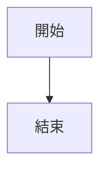

# SVG / Mermaid 渲染流程（Phase 3.6）

對偵測到的非 URL 型視覺內容，透過 playwright-cli 渲染為 PNG 截圖。

## 繁體中文字型支援（適用於所有渲染場景）

所有暫存 HTML 模板都必須包含以下字型設定，確保繁體中文正確顯示：

```html
<style>
  @import url('https://fonts.googleapis.com/css2?family=Noto+Sans+TC:wght@400;700&display=swap');
  * {
    font-family: 'Noto Sans TC', 'Microsoft JhengHei', '微軟正黑體', sans-serif;
  }
</style>
```

---

## Inline SVG 渲染

1. 從 Markdown/HTML 中提取完整的 `<svg>...</svg>` 區塊
2. 建立暫存 HTML 檔案：

```html
<!DOCTYPE html>
<html lang="zh-TW">
<head>
  <meta charset="UTF-8">
  <style>
    @import url('https://fonts.googleapis.com/css2?family=Noto+Sans+TC:wght@400;700&display=swap');
    body {
      margin: 0; padding: 16px; background: white;
      font-family: 'Noto Sans TC', 'Microsoft JhengHei', '微軟正黑體', sans-serif;
    }
    svg { max-width: 100%; height: auto; }
    svg text, svg tspan {
      font-family: 'Noto Sans TC', 'Microsoft JhengHei', '微軟正黑體', sans-serif;
    }
  </style>
</head>
<body>
  {{SVG_CONTENT}}
</body>
</html>
```

3. 使用 playwright-cli：
   - `playwright-cli open file:///tmp/markdown-creator-images/svg_001.html`
   - `playwright-cli snapshot` 確認 SVG 渲染完成
   - `playwright-cli eval "JSON.stringify(document.querySelector('svg').getBoundingClientRect())"` 取得 SVG 元素的實際尺寸
   - `playwright-cli screenshot --filename=/tmp/markdown-creator-images/svg_001.png` 截圖


4. 上傳截圖至 GitHub Issue（使用 image-processing skill 的 Step 3.4 流程）
5. 在 Markdown 中替換：原始 `<svg>...</svg>` → ``

---

## Mermaid 圖表渲染

1. 從 Markdown 中提取 ` ```mermaid ` 代碼區塊的內容
2. 建立暫存 HTML 檔案：

```html
<!DOCTYPE html>
<html lang="zh-TW">
<head>
  <meta charset="UTF-8">
  <style>
    @import url('https://fonts.googleapis.com/css2?family=Noto+Sans+TC:wght@400;700&display=swap');
    body {
      margin: 0; padding: 16px; background: white;
      font-family: 'Noto Sans TC', 'Microsoft JhengHei', '微軟正黑體', sans-serif;
    }
  </style>
</head>
<body>
  <pre class="mermaid">
  {{MERMAID_CODE}}
  </pre>
  <script type="module">
    import mermaid from 'https://cdn.jsdelivr.net/npm/mermaid@11/dist/mermaid.esm.min.mjs';
    mermaid.initialize({
      startOnLoad: true,
      theme: 'default',
      themeVariables: {
        fontFamily: "'Noto Sans TC', 'Microsoft JhengHei', sans-serif"
      }
    });
  </script>
</body>
</html>
```

3. 使用 playwright-cli：
   - `playwright-cli open file:///tmp/markdown-creator-images/mermaid_001.html`
   - `playwright-cli eval "await document.querySelector('.mermaid svg') || await new Promise(r => setTimeout(r, 2000))"` 等待 Mermaid 渲染完成
   - `playwright-cli screenshot --filename=/tmp/markdown-creator-images/mermaid_001.png` 截圖渲染結果

4. 上傳截圖至 GitHub Issue（使用 image-processing skill 的 Step 3.4 流程）
5. 在 Markdown 中替換：

```markdown
<!-- 替換前 -->


<!-- 替換後 -->


<details>
<summary>Mermaid 原始碼</summary>


</details>
```

> 保留 Mermaid 原始碼在 `<details>` 區塊中，方便日後編輯。

---

## 渲染失敗處理

| 情境 | 處理方式 |
|------|---------|
| Google Fonts CDN 無法載入 | 回退到系統字型（Windows: Microsoft JhengHei） |
| Mermaid.js CDN 無法載入 | 嘗試使用 `mermaid.ink` API：`https://mermaid.ink/img/{base64_encoded_mermaid}` |
| SVG 內容損壞 | 保留原始 SVG 代碼，標記 `[⚠️ SVG 渲染失敗]` |
| 截圖為空白 | 增加等待時間重試（最多 3 次），仍失敗則標記警告 |
| 中文字顯示為方塊/亂碼 | 檢查字型是否載入 → 改用本地字型路徑 → 最後用 `mermaid.ink` |
