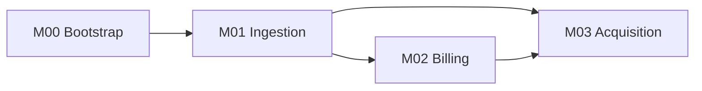

# ROADMAP.md 模板

ROADMAP.md 是**大計畫一頁式總覽**——人類進 repo 5 秒看完所有 milestone、依賴、時程、KPI。

設計原則：
- **business / strategic 視角**（不是技術細節，技術細節在卡片內）
- **可印一張 A4**——超過就太多
- **依賴與順序視覺化**——用 mermaid 或 ASCII
- **與 STATUS.md 互補**：ROADMAP 不變（計畫），STATUS 常變（進度）

## 完整模板

```markdown
# {Project Name} Roadmap

> **狀態**: ACTIVE
> **建立日期**: {YYYY-MM-DD}
> **最後更新**: {YYYY-MM-DD}
> **整體目標**: {一句話講商業目標，例：90 天內取得 1 個付費客戶}
> **整體 KPI**: {可量測的成功指標，例：1 個 AUD $39/月付費客戶}

## 大計畫

{2-3 段話講為什麼這專案存在、目標客戶、核心價值主張、為什麼現在做}

例：
TenderBeat 是澳洲首發、PLG SaaS 政府採購情報訂閱服務。90 天唯一 KPI 是 1 個付費澳洲客戶（AUD $39/月）。
所有 milestone 設計服務於「最快到付費」，不服務於「最優雅架構」。
一人運營（indie hacker），月 burn ≤ AUD $50-100，所有整合 async-first。

## Milestone 概覽

| ID | Milestone | Window | Status | KPI 摘要 |
|----|-----------|--------|--------|---------|
| M00 | Day 0 Bootstrap | Day 0 | ✅ done | repo / CI / 三 API 探針 |
| M01 | Ingestion Hardening | Week 1-4 | 🔄 doing | 7 day cron 0 中斷 + ≥100/天 |
| M02 | Billing Stripe + Reverse Charge | Week 7-8 | ⏳ todo | checkout 自測 + ToS 上線 |
| M03 | Customer Acquisition | Week 9-12 | ⏳ todo | 1 個付費客戶 |

## 依賴圖



或 ASCII（mermaid 不便時）：

```
M00 ──→ M01 ──┬──→ M02 ──┐
              │          │
              └──────────→ M03
```

## 線性執行順序

若無平行資源，建議順序：

1. M00 — 完成
2. M01 — 進行中
3. M02 — 待 M01 收尾
4. M03 — 待 M02 完成

## 範圍紀律（紅線）

**MVP 階段禁做**（避免 scope creep）：

- ❌ {禁做清單 1}
- ❌ {禁做清單 2}

例：
- ❌ VIC / QLD 採購源（Phase 2）
- ❌ UK Find a Tender（Phase 2）
- ❌ Chrome Extension / Discord bot
- ❌ 任何客製 dashboard 給單一客戶

## 2-Week Kill Switch

每 2 週評估一次 Go/NoGo。沒過就停，不繼續推。

| Checkpoint | Date | Go/NoGo 門檻 |
|------------|------|-------------|
| Week 2 | {YYYY-MM-DD} | 三 API 有回應 + PII filter 全綠 |
| Week 4 | {YYYY-MM-DD} | 連續 7 天 cron 無中斷 + ≥100/天 |
| Week 6 | {YYYY-MM-DD} | 3/5 ICP「願意付」 |
| Week 8 | {YYYY-MM-DD} | checkout 自測通過 + ToS 上線 |
| Week 10 | {YYYY-MM-DD} | 5 個 trial 用戶 |
| Week 12 | {YYYY-MM-DD} | ≥ 1 付費 + 3 trial |

## 商業 / 法律紅線

{列出本專案的不可違反原則，例：}

- 自然人 PII 在 ingestion 階段過濾，不存 DB
- 月 burn ≤ AUD $50-100
- 收到律師函 = automatic kill switch（24h 下架被質疑功能）
- 每週工時 ≤ 25h，超過 50h × 連 3 週 → 強制砍 scope

## 變更紀錄

- {YYYY-MM-DD}: {what changed} — {why}

例：
- 2026-05-14: 新增 M01 內 ATM scrape slice — 補 pre-award lifecycle 完整性
- 2026-04-01: M03 從「3 個付費」砍到「1 個付費」 — 90 天現實校準
```

## 不該放在 ROADMAP.md 的東西

- ❌ 任務拆解（放卡片內 Slices 段）
- ❌ 每日進度（放 STATUS.md）
- ❌ 技術設計細節（放卡片內 Decisions 段或 specs/engineering-plans/）
- ❌ 已完成 milestone 的詳情（卡片在 done/，這裡只列名 + ✅）

## 更新時機

| 何時 | 動作 |
|------|------|
| `create` action 後 | append 新 milestone 進「Milestone 概覽」+ 更新依賴圖 |
| `complete` action 後 | 將狀態改 ✅ |
| 大方向變更 | 改「大計畫」段 + append 變更紀錄 |
| 砍 scope | 改「範圍紀律」 + append 變更紀錄 |
| 重大時程調整 | 改 Window 欄 + append 變更紀錄 |

**不該每天動 ROADMAP.md**——它是計畫，不是日報。

## ROADMAP vs STATUS 對照

| | ROADMAP.md | STATUS.md |
|--|-----------|-----------|
| 視角 | strategic（大計畫） | tactical（這週做啥） |
| 變更頻率 | 月 / 計畫調整時 | 每週至少 1 次 |
| 內容 | milestone 列表 + 依賴 + KPI | 當前活躍 + 阻擋 + 下一步 48h |
| 目標讀者 | 5 秒掃完判斷「大方向對嗎」 | 30 秒掃完判斷「現在該做啥」 |
